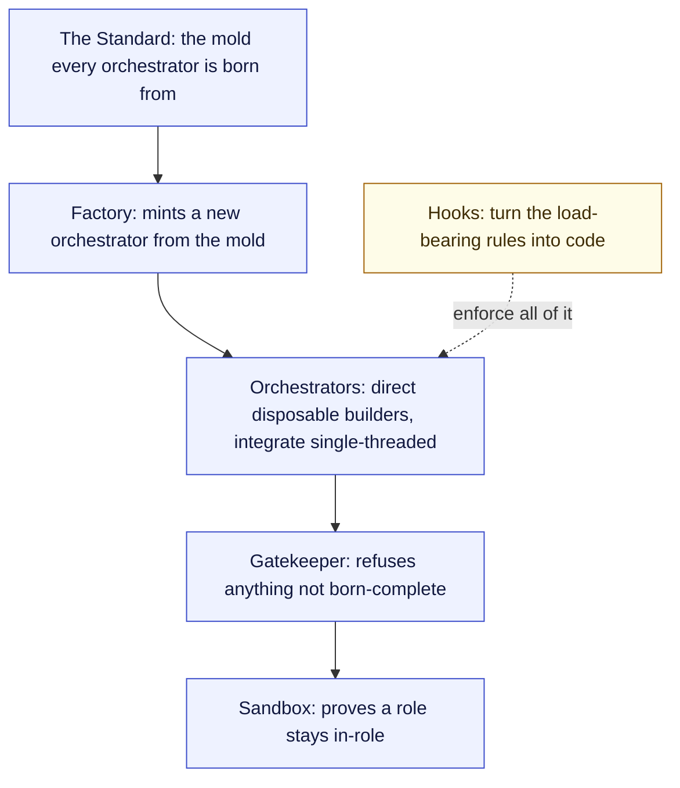

# Orchestrator OS

**An open operating system for building with AI through orchestration.** A methodology and reference system you read and adapt, not an app you install and run.

> Not another agent pack. This is the layer ABOVE the agents: a mold every orchestrator is born from, a factory that mints new ones, a gatekeeper that enforces the standard, and a sandbox that proves your roles stay in-role. Download it and it is already linked and interconnected, so you can read it as a living map, not a pile of files.

---

## Why this exists

Most AI work is one person typing at one model. That hits a ceiling: you forget half your own rules, you cannot hold a big system in one context, and quality swings with your energy. Orchestration is the way past it. You stop being the doer and become the director: a persistent orchestrator frames the work, disposable builders and specialists do the leaf work in parallel, and the writes flow back through a single integrator so nothing turns into a game of telephone.

The hard part was never the agents. It was the system around them: how a new orchestrator is born complete, how work is gated so the irreversible thing cannot slip through, how a role is tested so it does not drift, and how the whole thing stays a clean, navigable knowledge graph instead of rotting into chaos. That system is what this repo is.

## Who made this

Built by Alex Villarroel. I work in controls and automation and run my own company, Streamline Automation Solutions. Orchestrator OS is the system I built to run my work with AI. The honest version: most of the wins come from boring fundamentals like good file structure and short context, not magic. I am not a guru. Take what is useful.

## What is different

- **It leads with orchestration, not agents.** Agent and prompt collections are everywhere. The unique value here is the operating layer: [the standard](./the-standard/00_STANDARD_INDEX.md), [the ceremonies](./ceremonies/00_CEREMONIES_INDEX.md), [the orchestrator pattern](./orchestrators/00_ORCHESTRATORS_INDEX.md), and [the conformance harness](./sandbox/00_SANDBOX_INDEX.md).
- **It enforces itself.** Rules you only remember get forgotten. The [hooks layer](./hooks/00_HOOKS_INDEX.md) turns the load-bearing ones into scripts that run automatically, so a bad deploy or a corrupted file cannot slip through.
- **It is born complete.** A [factory](./ceremonies/factory-ceremony.md) mints a new orchestrator from the mold with its full folder set, ceremony, contract, prompt pack, and agent index, all cross-linked with zero orphans, and a [gatekeeper](./ceremonies/gatekeeper-ceremony.md) refuses anything that is not.
- **It is interconnected on download.** Every doc links to its neighbors and back to [the map](./00_MOC.md). Works in Obsidian and renders on GitHub.

## What is inside

| Area | What it is |
|---|---|
| 🏛️ [The Standard](./the-standard/00_STANDARD_INDEX.md) | the mold: what an orchestrator needs to be born complete |
| 🎼 [Orchestrators](./orchestrators/00_ORCHESTRATORS_INDEX.md) | the orchestrator pattern + the workflow pattern (adaptive vs deterministic) + a worked example |
| 📜 [Ceremonies](./ceremonies/00_CEREMONIES_INDEX.md) | the four operating spines (build · factory · gatekeeper · operator) + the multi-agent contract |
| 🧪 [Sandbox](./sandbox/00_SANDBOX_INDEX.md) | the role-conformance harness (prove a role stays in-role) |
| 🤖 [Agents](./agents/00_AGENTS_INDEX.md) | the categorized agent-library pattern + example agents |
| ⌨️ [Commands](./commands/00_COMMANDS_INDEX.md) | the prompt-pack pattern + an example full pack |
| 🧠 [Skills](./skills/00_SKILLS_INDEX.md) | the model-invoked skill pattern (SKILL.md, matched by description, progressive disclosure) + an example skill |
| 🪝 [Hooks](./hooks/00_HOOKS_INDEX.md) | the enforcement layer (fail-closed where it matters) |
| 📐 [Rules](./rules/00_RULES_INDEX.md) | knowledge discipline · naming conventions · orchestration-first |
| 🛠️ [Setups](./setups/00_SETUPS_INDEX.md) | step-by-step setup for every piece, each with a diagram |

## Quickstart

1. Read [the-philosophy](./the-philosophy.md) (about 5 minutes), then [the-shortform-guide](./the-shortform-guide.md) (about 30 minutes). The philosophy is the six beliefs everything rests on; the shortform explains the orchestrator-and-builder model and the one rule that makes it work.
2. Open [the map](./00_MOC.md) and skim the areas.
3. Copy [the example orchestrator](./orchestrators/example-orchestrator.md) and adapt it to your domain using [the standard](./the-standard/orchestrator-standard.md).
4. Pick the [setup guide](./setups/00_SETUPS_INDEX.md) for each piece you want and follow its diagram.

## Structure

A readable tree. Each area has a `00_*_INDEX.md` that lists its contents. The agents, commands, skills, and hooks follow the Claude Code conventions (`agents/<Category>/<name>.md` with YAML frontmatter, `skills/<name>/SKILL.md`, `hooks/*.js` wired via `hooks/hooks.json`), so they drop into a real setup.

## Philosophy

See [the-philosophy](./the-philosophy.md) for all six principles. Short version, four of the six: be real, enforce don't remember, fan out for intelligence and write single-threaded, and keep the knowledge a clean graph.

## License

Dual licensed. Code (agents, commands, hooks, scripts) under **MIT** ([LICENSE](./LICENSE)). Prose (ceremonies, the standard, guides, docs) under **CC-BY-4.0** ([LICENSE-docs](./LICENSE-docs)). Use it, adapt it, build on it.

## Credits

This stands on the shoulders of others. Full acknowledgements in [CREDITS](./CREDITS.md) (Everything Claude Code by Affaan Mustafa, Anthropic's Claude Code, Cognition's multi-agent research, and established knowledge-management and software-reliability disciplines).

## Contributing

PRs welcome. See [CONTRIBUTING](./CONTRIBUTING.md) and [CODE_OF_CONDUCT](./CODE_OF_CONDUCT.md). Found a security issue? [SECURITY](./SECURITY.md).

## Reach me

- Website: [alexvillarroel.com](https://alexvillarroel.com)
- GitHub: [@alex-villarroel](https://github.com/alex-villarroel)
- YouTube: [@alex-villarroel](https://youtube.com/@alex-villarroel)
- Instagram: [@alexvillarroel94](https://instagram.com/alexvillarroel94)
- TikTok: [@alexvillarroel94](https://tiktok.com/@alexvillarroel94)
- Email: me@alexvillarroel.com

## Support

If Orchestrator OS is useful to you, you can support the work through [GitHub Sponsors](https://github.com/sponsors/alex-villarroel). Sponsorship is optional. The project stays free and open either way.

*Created by Alex Villarroel · part of Orchestrator OS.*
