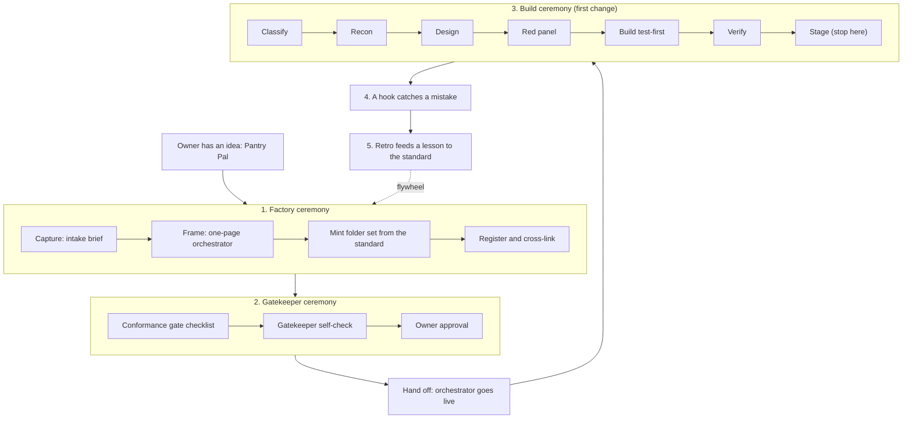
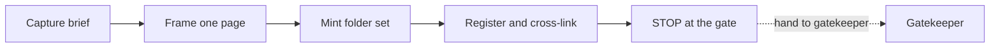
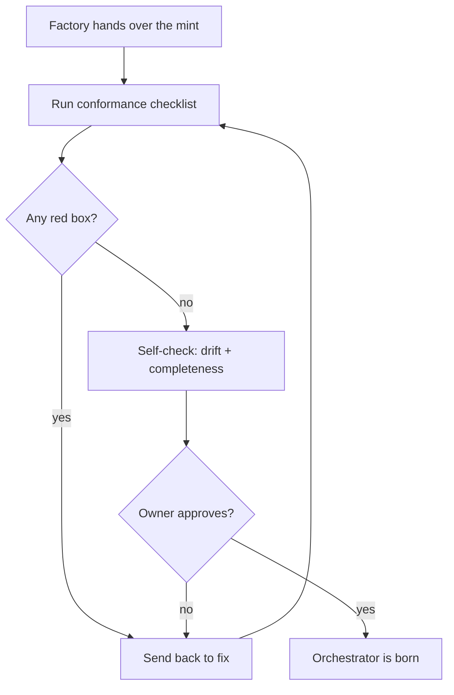
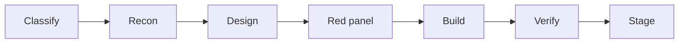
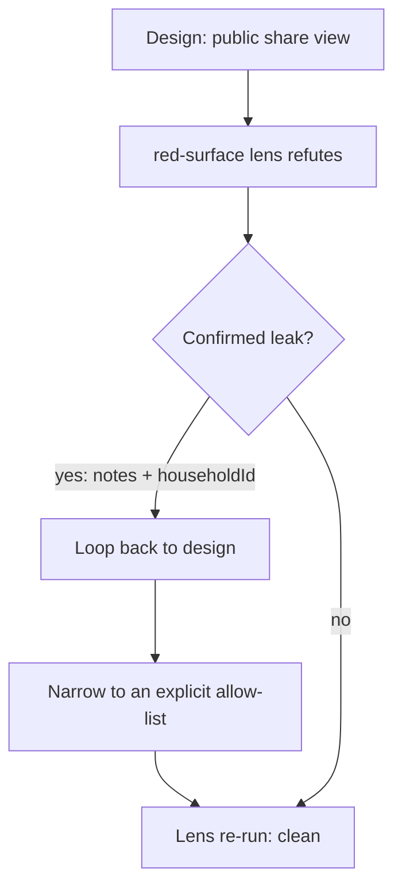
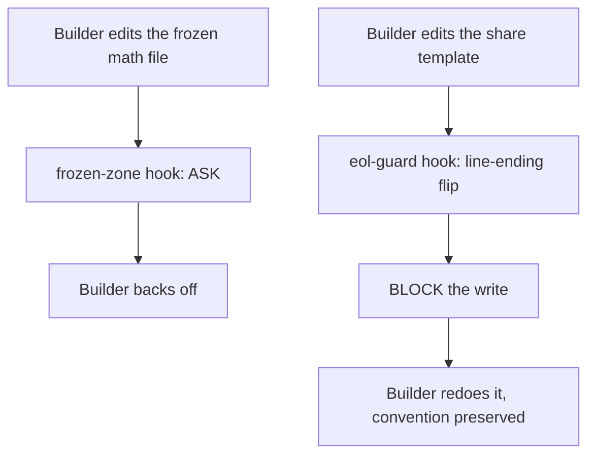
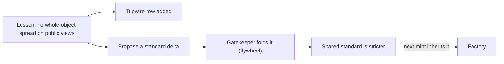

# Example Walkthrough

*One idea, followed all the way through the system: a maintainer dreams up a small app, the factory mints an orchestrator for it, the gatekeeper gates it, and the new orchestrator runs its first change end to end.*

← [00_EXAMPLES_INDEX](./00_EXAMPLES_INDEX.md) · [Orchestrator OS](../00_MOC.md)

Related: [factory](../ceremonies/factory-ceremony.md) · [gatekeeper](../ceremonies/gatekeeper-ceremony.md) · [build ceremony](../ceremonies/build-ceremony.md) · [hooks](../hooks/00_HOOKS_INDEX.md) · [example orchestrator](../orchestrators/example-orchestrator.md)

---

## The fictional idea

A maintainer (we will call her the owner) wants a small **recipe-organizer app**. You save recipes, tag them, build a weekly meal plan, and generate a shopping list. The working name is **Pantry Pal**. None of this is real; it is a harmless invented domain so we can watch the whole machine turn without leaning on any actual product, name, or path.

Follow Pantry Pal from a spark in the owner's head to a verified, staged first feature.

---

## The whole journey at a glance



The dotted line is the point of the whole thing: what we learn on the last change makes the next mint better.

---

## Stage 1: The factory mints an orchestrator
### Pattern: [factory ceremony](../ceremonies/factory-ceremony.md)

The owner does not start writing code. Every idea starts at the [factory](../ceremonies/factory-ceremony.md), which frames the idea and mints a tailor-made orchestration system for it from the one shared [orchestrator standard](../the-standard/orchestrator-standard.md).

**Step 0, classify.** The factory states its line before acting:

> `idea=app · scope=new-orchestrator · do=spawn:minting-role · model=high tier, design judgment · gate=gatekeeper conformance + owner`

This is a genuinely new domain, so it takes the **New idea to mint** lane: run the full mint spine plus the standard. (If Pantry Pal had been a feature of an app that already had an orchestrator, the factory would route it there instead of minting a duplicate.)

**1. Capture.** The factory writes the intake brief, separating the owner's product intent from inferred detail:

- **What it is:** a personal recipe organizer with meal planning and a shopping list.
- **Domain it owns:** recipe and meal-plan data for a single household.
- **Safety-critical action that will need a gate:** publishing a recipe to a **public share link** (the moment private data can leak out).
- **Frozen or forbidden zone:** the shopping-list quantity math (the one engine that totals ingredients across recipes) is frozen at birth. No agent rewrites that math.
- **Builders it needs:** a code builder writing to a repo we will call the app repo.

The factory never invents a constraint the owner has to set; the public-share decision and the frozen math are flagged for the owner to confirm.

**2. Frame.** One page, shown to the owner: the orchestrator's domain, its lanes, its roles, its model routing, and its safety gate. Frame before you mint.

**3. Mint from the standard (tailored, never copied).** The factory generates the full folder set the standard names. This is the same shape every orchestrator in the system carries (see [the example orchestrator](../orchestrators/example-orchestrator.md) for the annotated version):

```
Pantry Pal Orchestrator/
  Operating System.md          # pointer to ceremony + contract + library
  RESUME_PROMPT.md             # who it is, the orient walk, its loop, live state
  Pantry Pal MOC.md            # the hub
  MEMORY.md                    # this orchestrator's own role memory
  REFERENCE/                   # durable methods (roster, dispatch, escalations)
  MISSIONS/      [Active/ Complete/]
  PLANS/         [Active/ Complete/]
  DESIGNS/       [Active/ Complete/]
  DIRECTIVES/    [Active/ Complete/]   # builders start here
  Daily Contract/[Active/ Complete/]
  STATUS/                      # live trackers + run logs
  REPORTS/                     # ledgers / gap maps / test maps
  HANDOFFS/                    # session-to-session briefs
  CEREMONIES/                  # in-folder pointers to ceremony + contract
  Changes/                     # its change ledger
  Archives/                    # superseded docs
  commands/                    # its prompt pack
  agents/                      # its agent roster (00_AGENTS_INDEX)
  hooks/                       # its hooks (or a pointer to the repo's .claude/hooks/)
  setups/                      # stack setup / onboarding pointers
  secrets-rotation/            # secret inventory + schedule (NEVER values)
```

Alongside the folders it mints a tailored [build ceremony](../ceremonies/build-ceremony.md) and [multi-agent contract](../ceremonies/multi-agent-contract.md) for the recipe domain, a boot handoff, and the builder spec (a repo brief, the repo's agent config, a project instructions file, and a proposed ignore file). The **frozen** shopping-list math and the **forbidden** zones are named here, at birth, before the builder writes a line.

**4. Register and cross-link.** The factory fills every index in the right section and makes the new folder indexes wikilink-list their members, so every new file has an inbound link and the graph has zero orphans. It uses path-explicit links for shared basenames. It does **not** edit the gatekeeper-owned standard; it *proposes* a roster row and lets the gatekeeper fold it at the gate.

**Where the factory stops (the hard line):** the mint stops before the build. The factory produces all the scaffolding and config, then stops at the gate. It does not initialize version control, commit product source, or deploy. Those are the builder's first acts, after go-live, on the owner's word.



---

## Stage 2: The gatekeeper runs the conformance gate
### Pattern: [gatekeeper ceremony](../ceremonies/gatekeeper-ceremony.md)

The factory hands the minted Pantry Pal Orchestrator to the [gatekeeper](../ceremonies/gatekeeper-ceremony.md). Nothing goes live un-gated. A missing box means not born.

**The conformance gate checklist** the gatekeeper runs:

| Check | What the gatekeeper confirms for Pantry Pal |
|---|---|
| **Standard conformance** | every birth component is present and tailored, not copied: root files, the full work-folder set with `Active/` and `Complete/` on the lifecycle folders, the infra folders, the tailored ceremony and contract, the boot handoff, and the builder spec |
| **Builder spec** | the repo brief, the repo's agent config, the project instructions file, and a proposed ignore file all exist; the frozen shopping-list math and forbidden zones are named at birth |
| **Two-sided** | the review runs on both the vault side and the app repo side |
| **Cross-link integrity** | every index reconciled in the right section (start-here, home, table of contents, the atlas with a row and a count, the directory); every new folder index lists its members; path-explicit links for shared basenames; zero graph orphans |
| **Owner approval** | the orchestrator goes live only on the owner's word |

**The gatekeeper self-check**, run before any irreversible fold or registration:

- **drift-auditor**: every cited file and link resolves; the mint matches the frame; no scope drift.
- **completeness-critic**: every index reconciled; nothing left stale; not over-built.
- For this mint: the standard's checklist is 100% green.



On the first pass the gatekeeper finds one red: a `DESIGNS/Complete/` subfolder was missing its index, so two design stubs had no inbound link (graph orphans). The factory fixes it, the gatekeeper re-runs, the box turns green, and the owner approves. Pantry Pal Orchestrator is born.

**Hand off.** The new orchestrator takes its first directive from the owner; the factory steps back. The first directive: *"Let me share a single recipe with a friend by link."*

---

## Stage 3: The orchestrator runs its first change
### Pattern: [build ceremony](../ceremonies/build-ceremony.md)

The Pantry Pal Orchestrator now drives one change through the [build ceremony](../ceremonies/build-ceremony.md) spine. The first directive is a public-share-link feature, which trips a safety floor, so the back half of the ceremony bites hard.



### Classify

> `operation=FEATURE · size=standard · lane=C (touches: public surface) · phases=full · skipped=none`

The change is a new capability (FEATURE). It would be Standard by file count, but it exposes recipe data on a **public surface**, and public is a hard Critical floor. Doubt goes to the higher lane. The orchestrator records the fact that locked the lane: *public share link.*

### Recon
*Maps the real bytes before anything is designed.* See [build ceremony](../ceremonies/build-ceremony.md) Phase 1, and the [recon cartographer](../agents/Coding/recon-cartographer.md).

The orchestrator dispatches a recon pass over the app repo. It returns build-ready anchors, the data model, the reference exemplar to mirror, the per-file line-ending convention, and a **keys-touched manifest**. The keys-touched probe finds that a recipe record already carries a private `notes` field and a `householdId`. Risk flags are set from what recon found, not what the request claimed: *this feature can leak a private field if the share view is not narrowed.*

### Design
*Imitate by default, contest only when the shape is open.* See Phase 3.

There is already an exemplar in the repo: a read-only printable recipe view. The shape is not open, so the orchestrator **imitates** it and labels only the deltas: a share view reuses the printable renderer but takes an explicit allow-list of fields (title, ingredients, steps) and a random unguessable share token, never the database id. The design covers every acceptance criterion and names its rollback (drop the token, the link 404s).

### Red panel
*Refute the plan before it is built.* See Phase 4.

Because the change touches a public surface, the orchestrator dispatches the [correctness](../agents/Coding/red-correctness.md) lens plus a surface lens, fed the spec and design only, never the implementer's reasoning, and told to refute.

The surface lens lands a confirmed finding with an anchor and a concrete counterexample:

> The share view spreads the whole recipe object into the template. The private `notes` field and `householdId` ride along in the rendered HTML. A friend with the link can read the household's private notes.

The evidence rule is satisfied (exact anchor + counterexample + why the current guard misses it), so the finding is real, not manufactured. The design loops back once: the renderer is changed to take an explicit allow-list, so only the three intended fields can ever reach the page. The objection is resolved before a line of code is written, which is the cheapest place to catch it.



### Build
*Test-first, single-writer, proven.* See Phase 5.

The builder writes the behavioral assertions from the spec first, watches them go red for the right reason, then green. It builds only in the in-lane files. It reuses the existing printable renderer and the frozen shopping-list math is never touched. Every free-text interpolation in the share template is escaped. Edits are backup-first and count-asserted.

### Verify
*Prove it, independently, against the running thing.* See Phase 6. This is a different mind than the builder.

- **Frozen-proof:** the shopping-list math core is byte-identical to the prior shipped artifact.
- **Drift-check:** only the intended files differ; exactly the intended new key (the share token) appeared; no scope creep.
- **Behavioral verify:** the verifier drives the running app, opens a share link in a clean session, and confirms the recipe renders with title, ingredients, and steps, and that `notes` and `householdId` are **absent** from the page source. Console clean.
- **Byte-exactness:** line endings on each touched file are preserved, and a syntax check passes.

### Stage

The change is staged for the owner's go. (This walkthrough stops at stage; the ship and post-verify steps of the [build ceremony](../ceremonies/build-ceremony.md) would follow on the owner's word.)

---

## Stage 4: A hook catches a mistake
### Pattern: [hooks](../hooks/00_HOOKS_INDEX.md)

Enforcement is not left to memory. During the build, the harness ran the [hooks](../hooks/00_HOOKS_INDEX.md) on lifecycle events. Two of them earned their keep on this change.

**The frozen-zone hook.** While exploring, the builder tried to "tidy" a helper that happened to live inside the frozen shopping-list math file. The `frozen-zone.js` hook fired on the Edit, matched the configurable frozen-file list, and returned an **ASK** decision: this file is frozen, confirm before editing. The builder backed off and routed the tidy elsewhere. The frozen math stayed byte-identical, which is exactly why the verify step's frozen-proof passed cleanly.

**The line-ending guard.** On a later edit, the builder's tool rewrote the share template with the wrong line endings (a CRLF-to-LF flip). The `eol-guard.js` hook snapshotted the CR count before the edit and verified it after, caught the confirmed flip, and **blocked** the write with a clear message. The builder re-made the edit preserving the convention. The mistake never reached the staged artifact.



Posture by blast radius: both reversible-with-uncertainty cases were handled gently (ask, or block-and-retry), and every hook honors the `HOOKS_OFF=1` kill switch so a buggy hook never bricks work. A check a script can run was never delegated to a panel.

---

## Stage 5: The retro feeds a lesson back to the standard
### Pattern: [gatekeeper retro flywheel](../ceremonies/gatekeeper-ceremony.md)

After the change, the retro asks: what did we learn, and where does it get teeth? See Phase 9 of the [build ceremony](../ceremonies/build-ceremony.md) and the flywheel in the [gatekeeper ceremony](../ceremonies/gatekeeper-ceremony.md).

The lesson from this change: **a public share view must render from an explicit field allow-list, never a whole-object spread.** The red panel caught it this time, but relying on a panel to catch the same class every time is a lesson, not a rule.

The retro turns it into something enforced. The orchestrator banks two artifacts and **proposes** a standard delta to the gatekeeper (it does not edit the standard itself):

- A **tripwire row**: an exact assert that fails if a share-rendered page ever contains a private field name. It runs at the gate against the staged artifact, and against the live surface after any future ship.
- A proposed line for the shared [orchestrator standard](../the-standard/orchestrator-standard.md): any orchestrator with a public surface declares its public field allow-list at birth, `enforced_by: red-charter:red-surface` plus the new tripwire.

Every new rule names its `enforced_by` point or it stays a lesson. The gatekeeper owns and folds the standard delta through the flywheel, on the owner's word. Now the **next** idea that goes through the factory inherits a stricter mold: its mint will ask for a public field allow-list up front, before its builder writes a line.



That dotted line back to the factory is the flywheel closing. The system got stricter exactly where strictness has teeth, and it got there from a real miss on a real change.

---

## The takeaway

One idea (a recipe organizer) went through the entire system: the [factory](../ceremonies/factory-ceremony.md) framed and minted an orchestrator for it from the shared standard, the [gatekeeper](../ceremonies/gatekeeper-ceremony.md) gated it, the new orchestrator ran its first change through the [build ceremony](../ceremonies/build-ceremony.md) spine, the [hooks](../hooks/00_HOOKS_INDEX.md) caught two mistakes a script can catch, and the retro fed a lesson back through the gatekeeper into the standard so the next mint is born stricter. Every stage points at its pattern doc; copy the shapes, swap in your own domain, and the same machine runs for you.

See [the example orchestrator](../orchestrators/example-orchestrator.md) for the static shape of what gets minted, and [the orchestrator standard](../the-standard/orchestrator-standard.md) for the full birth checklist.

---
*Example walkthrough of Orchestrator OS: one idea through factory, gatekeeper, build ceremony, hooks, and retro. The domain (Pantry Pal) is fictional. Living document. ← [00_EXAMPLES_INDEX](./00_EXAMPLES_INDEX.md) · [Orchestrator OS](../00_MOC.md).*

*Created by Alex Villarroel · part of Orchestrator OS.*
