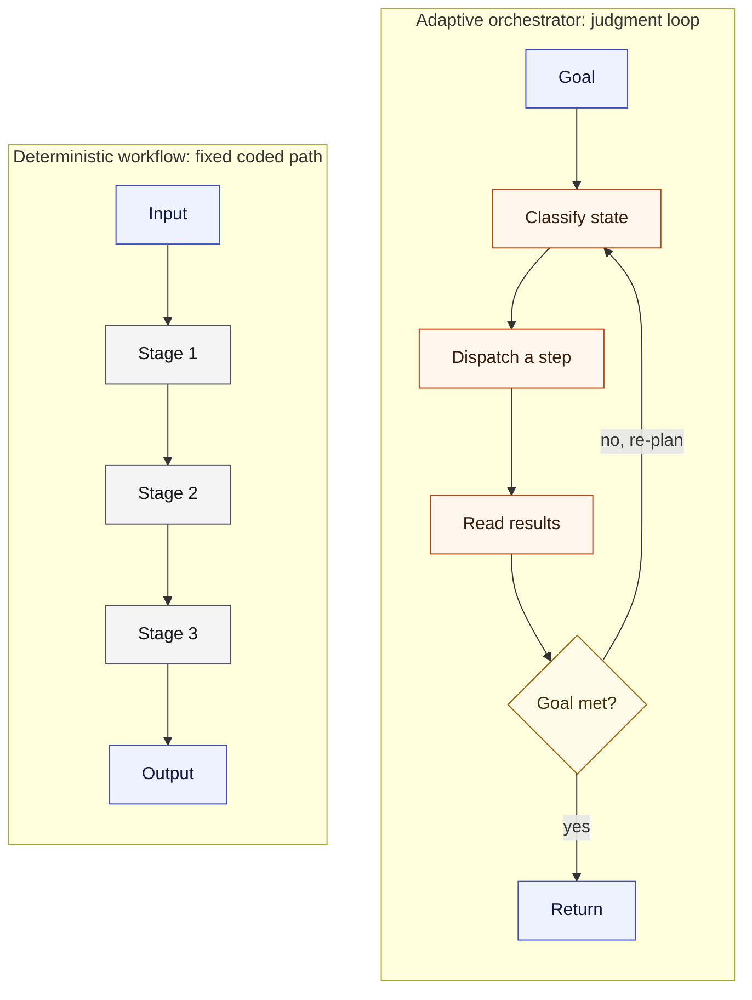
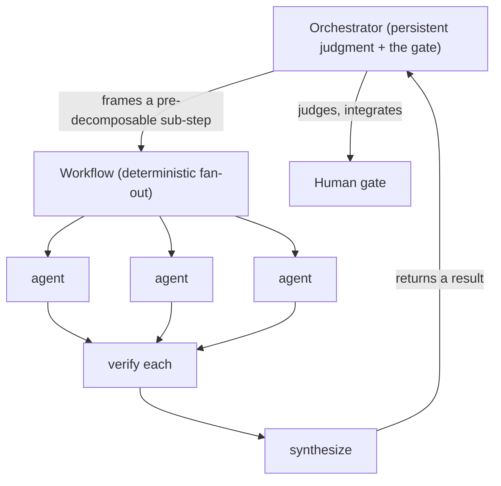
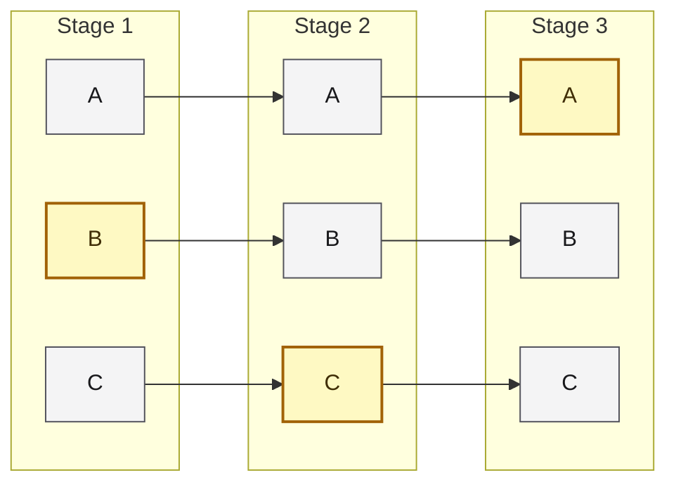
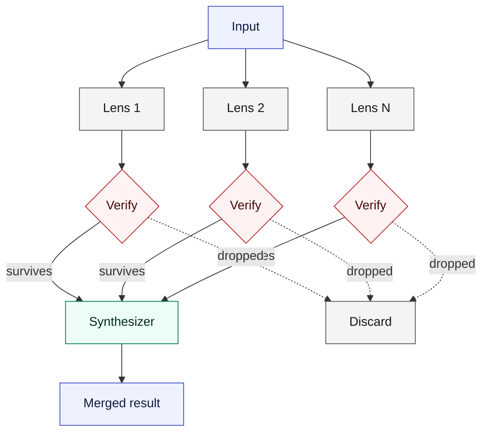
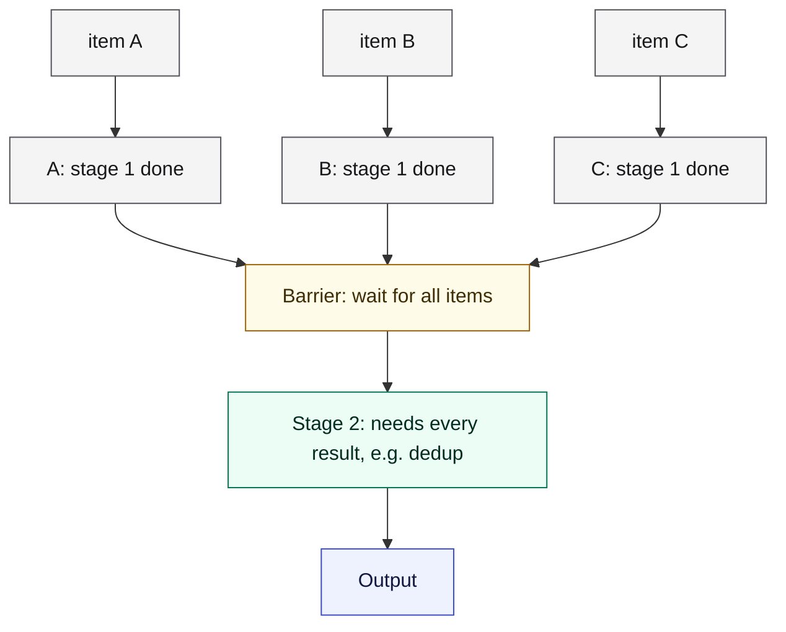
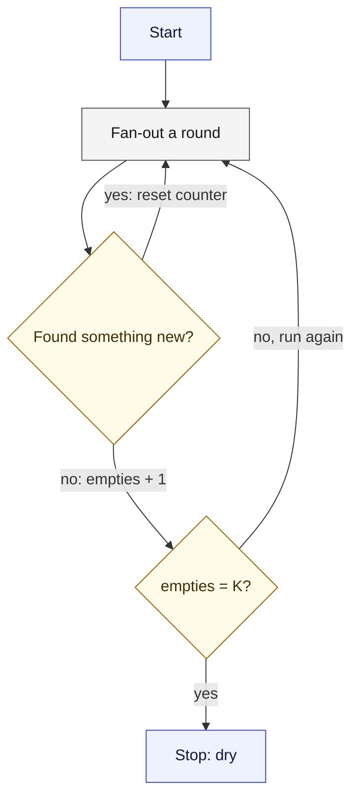

# The workflow pattern

*The second mode of orchestration: a deterministic, code-driven harness that fans agents through a fixed path. When the shape of the work is known and you want it run wide and repeatably, you script it instead of steering it by hand. ← [00_ORCHESTRATORS_INDEX](./00_ORCHESTRATORS_INDEX.md) · [Orchestrator OS](../00_MOC.md).*

---

## The one-line definition

A **workflow** is orchestration with the control flow written as code. Instead of a persistent orchestrator deciding each next step by judgment, a script encodes the steps in advance: fan out these agents, run them through these stages, verify each result, synthesize. Same path every run, parallel, resumable. The agents fill the leaf nodes; the structure is fixed.

This is the distinction between an **agent and a workflow**: a workflow runs model calls through **predefined code paths**; an agent (the orchestrator) **dynamically directs its own process**. Both are valid. They are different tools for different shapes of work.

## The two modes, side by side

| | Orchestrator (adaptive) | Workflow (deterministic) |
|---|---|---|
| **Control flow** | Judgment-driven; decides each next step from what it sees | Code-driven; the path is fixed in advance |
| **Best when** | The shape is unknown, discovered by recon; the plan changes | The shape is known and can be pre-decomposed |
| **Strength** | Adapts, re-plans, handles surprise, gates with a human, carries state | Scale, parallel wall-clock, repeatable, resumable, consistent run-to-run |
| **State** | Persistent: memory, continuity, the knowledge graph | One-shot: fires and returns; no memory between runs except its journal |
| **Failure mode** | Context bloat, drift, single-thread bottleneck, run-to-run inconsistency | Confidently executes a rigid or wrong plan; volume without judgment |

*The orchestrator decides the next move each turn by reading what came back; the workflow runs a path you already wrote.*

## When to use a workflow

- The task is **pre-decomposable**: you can write the steps down before you start.
- You need **breadth or scale**: many files, sources, or candidates, attacked in parallel.
- It is a **recurring, standardized process**: a review, a research sweep, an audit, a migration, test generation. Author once, rerun forever.
- You want **determinism**: the same input produces the same shape of output, resumable if it fails partway.
- The quality pattern is **structured**: fan out, verify, synthesize (below).

## When NOT to use a workflow

- The **path is unknown** and only recon will reveal the real work. Steering by judgment beats a guessed script.
- The task needs **adaptation, re-planning, or surprise-handling** mid-run.
- There is a **human gate or continuity** in the loop: a workflow runs to completion on its own and cannot stop to ask.
- The step is **small, trivial, or one-off**: the cost of authoring the script exceeds the work. Do it directly.
- The action is **irreversible or high-stakes** (deploy, money, an external send). A script must never own that call; the orchestrator and its gate do.

## How they compose (the important part)

A workflow is **a power tool the orchestrator wields, not a rival to it.** The orchestrator frames the work, decides a sub-step is pre-decomposable and wide enough to script, runs the workflow, reads its output, judges it, integrates it, and gates with the human. It does not run the other way: a workflow has no continuity, no memory, and no judgment of its own, and it cannot gate mid-run. Nesting stays one level deep.

So "orchestrator vs workflow" is partly a category difference. The orchestrator is an **operating system** (roles, ceremonies, rules, memory, the gate). A workflow is an **execution primitive**. The OS runs workflows. A workflow is not an OS.

## The canonical workflow patterns

When you do script one, these are the shapes that pay off. They adapt the recognized agent-workflow patterns from Anthropic's "Building Effective Agents" (see [CREDITS](../CREDITS.md)); the diagrams here are original recreations.

### Pipeline (adapts prompt chaining)

Run each item through all stages independently, no barrier between stages, so item A can be in stage 3 while item B is still in stage 1. The default for multi-stage work.

*One snapshot in time: A is already at stage 3 while B is still at stage 1, because no barrier holds the items together.*

### Fan out, verify, synthesize (adapts orchestrator-workers + evaluator-optimizer)

Run N lenses in parallel, adversarially verify each finding (a skeptic that tries to refute it), then merge the survivors. Stops plausible-but-wrong results from shipping.

*One input fans out to N lenses, each finding faces an adversarial check, and only survivors reach the synthesizer.*

### Barrier, only when needed (adapts parallelization)

Synchronize across all items only when a stage genuinely needs every prior result at once (dedup, early-exit on zero, compare-against-the-others). Otherwise a barrier just wastes wall-clock.

*Every item must finish stage 1 before the barrier opens, because stage 2 cannot run on a partial set.*

### Loop until dry (adapts evaluator-optimizer)

For unknown-size discovery (bugs, gaps, edge cases), keep fanning out until a few rounds find nothing new, rather than guessing a fixed count.

*A new finding resets the count; the loop stops only once K rounds in a row turn up nothing.*

## The failure modes (where the judgment lives)

- **Workflow over-reach.** The tool is seductive. Fanning out a hundred agents on a vaguely-shaped task produces volume without judgment and burns real tokens; a misused barrier wastes wall-clock. Do not script what you have not shaped.
- **Orchestrator over-reach.** Doing by hand, sequentially, what should have been a workflow: slow, inconsistent run-to-run, does not scale, bottlenecks on one mind.

The skill is the intake call itself, which is why it lives in the intake rule: **do-direct, orchestrate-adaptively, or run-a-workflow.**

## The rule of thumb

**If you can write the steps down before you start and you want them run wide and repeatably, script it as a workflow. If you have to think, adapt, gate, and remember, steer it as the orchestrator. And the orchestrator is what decides which.**

## Related

- [orchestration-first](../rules/orchestration-first.md) - the intake rule where the three modes (direct, orchestrate, workflow) are chosen.
- [the-orchestrator-pattern](./the-orchestrator-pattern.md) - the adaptive mode, and the role that wields the workflow.
- [multi-agent-contract](../ceremonies/multi-agent-contract.md) - the dispatch standard and guardrails the leaf agents still follow.

---

*The agents-versus-workflows distinction and the canonical patterns (prompt chaining, routing, parallelization, orchestrator-workers, evaluator-optimizer) are adapted, not copied, from Anthropic's "Building Effective Agents" (Erik Schluntz and Barry Zhang, 2024, https://www.anthropic.com/engineering/building-effective-agents); the diagrams here are original recreations. The single-integrator principle is from Cognition. Full acknowledgements: [CREDITS](../CREDITS.md).*

← [00_ORCHESTRATORS_INDEX](./00_ORCHESTRATORS_INDEX.md) · [Orchestrator OS](../00_MOC.md)

*Created by Alex Villarroel · part of Orchestrator OS.*
