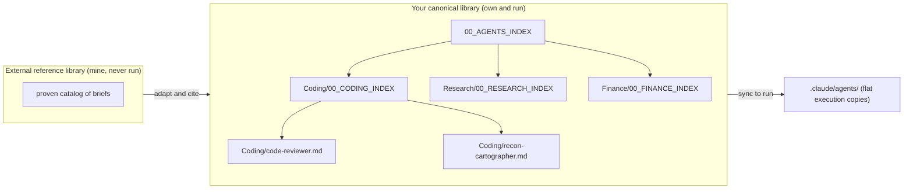

# Setup: The Agent Library

*Stand up a categorized library of reusable subagent briefs: one folder per domain, a category index that lists every member so nothing orphans, path-explicit links, the two-library rule, and flat execution copies in the repo.*

← [00_SETUPS_INDEX](./00_SETUPS_INDEX.md) · [Orchestrator OS](../00_MOC.md)

---

## What you are setting up

A clean home for your agent briefs. Each brief is a reusable subagent the orchestrator can spawn by type. The library you build here is the canonical knowledge of each agent: where briefs are designed, reviewed, and kept in the graph. A separate flat copy inside the code repo is what actually runs.

Two libraries exist and never blur. Your canonical library is the one you own and run. An external reference library is a proven catalog you mine for ideas but never wire into a ceremony. You adapt from the second into the first, and you cite when you do.

## The two-library model and the category folders



Solid arrows down the canonical side are the index-to-member graph: the top index links every category index, and each category index links every brief in its folder. The arrow from the external library is the only flow allowed across the boundary, and it carries an adaptation, never a raw copy. The arrow to the repo is a one-directional deploy of execution copies.

## Setup steps

1. **Create the library root and the top index.** Make an `agents/` folder. Inside it create `00_AGENTS_INDEX.md` with an intro line, the category model, and an empty list you will fill as categories appear. This is the single inbound root for the whole library.

2. **Create your first category folder.** Categories group by the work the agent does, not the project that uses it. Pick from the standard set:

   > Coding, Research, Data, Writing, Marketing, Business, Support, Finance, Creative, Education, Legal, Lifestyle, Meta

   Make the folder, for example `agents/Coding/`. An agent belongs to exactly one category. If a brief fits none, that is the signal to open a new category, not to wedge it in.

3. **Add the category index.** In the new folder create `00_<CATEGORY>_INDEX.md`, for example `agents/Coding/00_CODING_INDEX.md`. Its structural job is to wikilink-list every brief in that folder. Then add a row for this category index to the top `00_AGENTS_INDEX.md`. Both edits land in the same change.

4. **Add an agent brief with frontmatter.** Create `agents/Coding/code-reviewer.md`. Open it with the standard brief frontmatter so a harness can read it:

   ```markdown
   ---
   name: code-reviewer
   description: Six-category review of a built diff against its spec.
   tools: Read, Grep, Glob, Bash
   ---

   # code-reviewer

   *One-line charter. Adapted from <source> if borrowed.*

   ## When to use
   ...

   ## Method
   ...
   ```

   Keep the body to the charter, when-to-use, and method. No personal data, no secrets, no machine paths.

The three fields above are the floor. Optional frontmatter the harness also reads: `model` (pin a tier, for example `model: sonnet`), `disallowedTools` (subtract specific tools from the allowed set, for example to keep a reviewer read-only), and `skills` (the skills this agent may invoke). Add them when a role needs them.

5. **Reconcile the index in the same change.** Add the brief's row to its category index, and confirm the brief footer links back up to that index. The rule is two-way and absolute: the index lists the member so it has an inbound link, and the member links back so you can climb up. A brief added without its index row is an orphan.

6. **Link path-explicit, always.** Agent basenames repeat across the canonical library, the external reference, and the repo execution copy. A bare `[[code-reviewer]]` mis-resolves silently. Link by full path with a display alias every time:

   ```
   [[agents/Coding/code-reviewer|code-reviewer]]
   ```

   Reserve bare wikilinks for notes whose basename is genuinely unique.

7. **Adapt from the external library, never copy.** When you pull a brief idea from the reference catalog, rewrite it for your domain and add a short `*Adapted from <source>*` line. Treat the external library as a quarry, not a dependency. It never gets wired into a ceremony.

8. **Sync flat execution copies into the repo.** A code orchestrator that actually runs these agents keeps flat copies at `.claude/agents/` in its repo, no category folders, because that is where the harness discovers them. Author and curate in the vault category folder, then copy the file out to `.claude/agents/<name>.md` when the orchestrator needs to run it. The vault is the source of truth; the repo copy is a deployment artifact.

## You are done when

- Every brief lives at `agents/<Category>/<name>.md` and opens with valid frontmatter (`name`, `description`, `tools`).
- The top index links every category index, and every category index links every brief in its folder, two-way, with zero orphans.
- Every agent link in your indexes is path-explicit, so no shared basename mis-resolves.
- Any borrowed brief carries an `*Adapted from*` citation and is never wired into a live ceremony.
- The orchestrator can spawn a brief by type because a flat execution copy exists in the repo `.claude/agents/`.

## Related

- [the-agent-library-pattern](../agents/the-agent-library-pattern.md): the full pattern and the reasoning behind every rule above.
- [00_AGENTS_INDEX](../agents/00_AGENTS_INDEX.md): the live top index this guide builds.
- [README](../hooks/README.md): make the zero-orphan and naming rules un-forgettable by running them as code.

*Created by Alex Villarroel · part of Orchestrator OS.*
