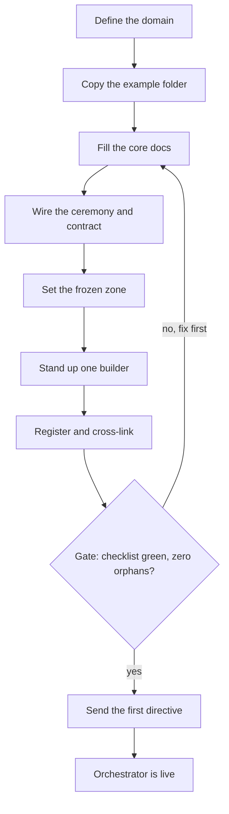

*Stand up your first orchestrator by hand, minted from the standard: define the one domain it owns, copy the worked example, fill the core docs, wire the ceremony and contract, set the frozen zone, then send the first directive.*

← [[setups/00_SETUPS_INDEX|00_SETUPS_INDEX]] · [[00_MOC|Orchestration OS]]

---

## What you are building

A **persistent point man for one domain** that directs disposable sub-agents and never does the leaf work itself. It classifies a request, dispatches the right worker with a tight brief, verifies the result independently, and integrates on a single thread. The shape is constant; only the domain changes. This guide builds one by hand so you understand every piece. To mint many without hand building each, use [[setups/setup-the-factory|setup-the-factory]] once you have done this once.

## Prerequisites

- You have read [[the-standard/orchestrator-standard|orchestrator-standard]] (the mold and the birth checklist) and [[orchestrators/the-orchestrator-pattern|the-orchestrator-pattern]] (the why).
- You have the worked [[orchestrators/example-orchestrator|example-orchestrator]] open as the shape to clone.
- You can edit the vault and create folders at its root.
- You can name one domain the orchestrator will own and the one irreversible action that domain commits (deploy, publish, money commit, external send). If you cannot name those two yet, stop and shape the idea first.

## The flow



## Setup steps

### 1. Define the domain

Write one page that answers four things, because everything downstream fills from them:

- **Name:** the orchestrator name (Title Case folder, for example `Release Orchestrator`).
- **Domain:** the one thing it owns and is accountable for. One domain, not three.
- **Irreversible action its gate protects:** the domain's commit point (deploy, publish, money commit, external send). This is what the safety gate will guard.
- **Builder:** its doer tier. For a code domain this is a real builder spanning a knowledge brief plus a code repo. For a non code domain it is just the sub-agent roster.

Replace the four placeholders from the example as you go: the orchestrator name, the domain, the app repo (code domains only), and the builder.

### 2. Copy the example folder

Copy the full folder set from [[orchestrators/example-orchestrator|example-orchestrator]], renaming `Example Orchestrator/` to your orchestrator. Keep the FULL standard structure, not a lean subset. Carry the `Active/` and `Complete/` lifecycle subfolders on the five lifecycle folders (Daily Contract, DIRECTIVES, MISSIONS, DESIGNS, PLANS) and keep the other folders flat. Carry all five infra folders: `commands/`, `agents/`, `hooks/`, `setups/`, `secrets-rotation/`.

The skeleton you are placing:

```
Your Orchestrator/
  Operating System.md          one click pointer to ceremony, contract, library
  RESUME_PROMPT.md             who it is, the orient walk, its loop, live state
  Your Orchestrator MOC.md     the hub
  MEMORY.md                    this orchestrator's own role memory
  REFERENCE/                   durable methods (roster, dispatch, escalations)
  MISSIONS/      Active/ Complete/
  PLANS/         Active/ Complete/
  DESIGNS/       Active/ Complete/
  DIRECTIVES/    Active/ Complete/
  Daily Contract/Active/ Complete/
  STATUS/        REPORTS/      HANDOFFS/      Archives/   (flat)
  CEREMONIES/                  in-folder pointers to its ceremony and contract
  Changes/                     its change ledger
  commands/ agents/ hooks/ setups/ secrets-rotation/   (the five infra folders)
```

### 3. Fill the core docs

From the shapes in the example, write the five core docs for your domain (do not leave placeholder text):

- **RESUME_PROMPT.md:** who it is, the orient walk (read the MOC, read its ceremony and contract IN FULL, read MEMORY, read STATUS), its loop (classify, ground, frame, dispatch, verify, integrate, close), standing rules, and a live state block.
- **Operating System.md:** a one click pointer to its ceremony, its contract, the standard it was minted from, its agent library (path explicit), and its prompt pack. Pointers only, never copied content.
- **Your Orchestrator MOC.md:** the hub that links out to every area of the folder and to its sibling orchestrators.
- **MEMORY.md:** its own role memory (battle scars, role facts, learnings). The retro loop writes here; cross cutting memory stays in the shared brain.
- **commands/Your Orchestrator Prompts.md:** a FULL situational prompt pack, not a thin starter (boot, frame, dispatch, wave run, verify, gate, integrate, incident, retro, builder boot).

### 4. Wire the ceremony and contract

Do not copy a ceremony into the folder. Point at the canonical versions and tailor a pair for your domain:

- **Ceremony** ([[ceremonies/build-ceremony|build-ceremony]]): the per task spine (classify, recon, spec, design panel, red panel, build, verify, gate, ship, retro). Tailor the lanes and the specific irreversible action its gate protects.
- **Contract** ([[ceremonies/multi-agent-contract|multi-agent-contract]]): the roster, the dispatch standard and return schema, model routing, and the guardrails. Tailor the roles and the never do list.

The `CEREMONIES/` folder holds in-folder pointers only. RESUME_PROMPT.md points DIRECTLY at the ceremony and contract wikilinks so the orchestrator reads them in full on boot.

### 5. Set the frozen zone

Name the untouchables BEFORE the builder writes a line: the frozen modules (byte identical, never edited) and the forbidden zone (off limits to this orchestrator). Record them in REFERENCE and reference them from the ceremony's gate. The gate that protects the irreversible action checks the frozen zone is intact every run.

### 6. Stand up one builder

Wire at least one builder immediately, with the agents it needs:

- **Code domain:** a knowledge side brief (`Your Builder/` with its own MOC, RESUME, and spec docs, the brief it reads) AND a work side repo with its `.claude/` config (settings, hooks, execution agent copies, where it builds and is verified). Both sides must exist.
- **Non code domain:** the sub-agent roster only (researchers, drafters, reviewers), knowledge side, no repo.

In `agents/00_AGENTS_INDEX.md` point at TWO distinct libraries: your own canonical library path explicit as `[[Agents/00_AGENTS_INDEX|Agents]]` (a bare `[[Agents]]` mis-resolves), and an external reference library you mine and adapt, never blind copy.

### 7. Register and cross-link

Make it integrated, not just listed. Reconcile EVERY index in the same change: the start here role table, the home hub and table of contents, the atlas (row plus count plus drift check), and the directory. Then two way links: the orchestrator links its siblings and the roster links it back; it links the standard it was built to and the standard's roster names it. Every new folder index wikilink lists its members so every new file has an inbound link. Use path explicit links for shared basenames. Verify backlinks are clean and there are ZERO graph orphans. A query generated list aggregates but makes no graph edge, so it does not count as integration.

## You are done when

- The §2 checklist of [[the-standard/orchestrator-standard|orchestrator-standard]] is 100 percent green: folder with the full structure, the five core docs, a tailored ceremony and contract, a full prompt pack, a boot handoff, and at least one builder wired.
- The frozen and forbidden zones are named.
- Every index is reconciled and a backlink check shows zero orphans (every new doc has at least one inbound wikilink).
- The orchestrator boots from its RESUME_PROMPT, states its classifier line, takes its first directive, dispatches a builder, verifies the result independently, and stops at its gate before the irreversible action.
- A changelog entry records the creation, revert ready.

## Related

- [[the-standard/orchestrator-standard|orchestrator-standard]]: the mold and the full birth checklist this guide walks.
- [[orchestrators/example-orchestrator|example-orchestrator]]: the worked folder you copy.
- [[ceremonies/build-ceremony|build-ceremony]]: the per task spine you tailor and point at.
- [[ceremonies/multi-agent-contract|multi-agent-contract]]: the roster and dispatch structure you tailor and point at.
- [[setups/setup-the-factory|setup-the-factory]]: once you have built one by hand, mint the rest.

---
*Setup an orchestrator: Orchestration OS. Adapted from the worked example template (ECC, MIT), Anthropic multi-agent guidance, and Cognition single-threaded-integration.*

← [[setups/00_SETUPS_INDEX|00_SETUPS_INDEX]] · [[00_MOC|Orchestration OS]]

*Created by Alex Villarroel · part of Orchestration OS.*
