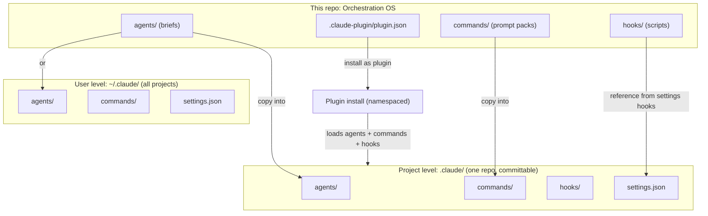

# Setup: Claude Code

*The on-ramp. Get from zero to running Orchestration OS inside a real Claude Code setup: install the CLI, learn the `.claude/` layout, drop in the agents, commands, and hooks from this repo, or install the whole thing as a plugin.*

← [[setups/00_SETUPS_INDEX|00_SETUPS_INDEX]] · [[00_MOC|Orchestration OS]]

---

## What you are setting up

Orchestration OS is knowledge you read and adapt, not an app you launch. But the building blocks (agents, commands, hooks) follow Claude Code conventions, so you can copy them straight into a working `.claude/` configuration and run them. This guide gets a real Claude Code setup standing, then shows the two ways to wire this repo into it: drop the pieces into a `.claude/` directory by hand, or install the whole repo as a plugin from its `.claude-plugin/plugin.json` manifest.

Claude Code reads configuration from two layers. **User level** lives in `~/.claude/` (on Windows, your home directory) and applies to every project you open. **Project level** lives in a `.claude/` folder at the root of one repository and applies only there, so it can be committed and shared with a team. When the same agent or command name exists in both, the project copy wins for that project.

## How it fits together



Solid arrows are the two install paths. The left path is the manual copy into a `.claude/` directory. The right path bundles the same pieces as a plugin so a teammate installs them in one step instead of copying files.

## Prerequisites

- A supported operating system (macOS 13+, Windows 10 1809+, or a recent Linux). 4 GB RAM or more.
- A terminal: Bash, Zsh, PowerShell, or CMD.
- An account with Claude Code access (Pro, Max, Team, Enterprise, or an API provider). The free tier does not include Claude Code.
- Git, so you can clone this repo and commit a project `.claude/` config.
- Node 18 or later, only if you install via npm or want the example hook scripts in [[hooks/README|README]] to run.

## Setup steps

1. **Install Claude Code.** Use the native installer for your platform:
   - macOS, Linux, WSL: `curl -fsSL https://claude.ai/install.sh | bash`
   - Windows PowerShell: `irm https://claude.ai/install.ps1 | iex`
   - Or with npm on any platform: `npm install -g @anthropic-ai/claude-code`

2. **Verify and authenticate.** Run `claude --version` to confirm the binary is on your path, then `claude doctor` for a deeper check. Launch `claude` once and follow the browser prompt to log in.

3. **Learn the `.claude/` layout.** Two scopes, same shape:
   - User scope at `~/.claude/` holds `agents/`, `commands/` (now also `skills/`), and `settings.json`. It applies to every project.
   - Project scope at `.claude/` (committed to a repo root) holds `agents/`, `commands/`, `hooks/`, and `settings.json`. It applies only to that repo, and overrides user scope on name clashes.

4. **Clone this repo.** Pull Orchestration OS down locally so you have its `agents/`, `commands/`, and `hooks/` folders to draw from. This repo is the canonical library you mine. See [[agents/the-agent-library-pattern|the-agent-library-pattern]] for the own-and-run versus mine-never-run distinction: adapt, do not blind-copy, and cite the source.

5. **Drop in agents.** Copy the agent briefs you want into a flat `.claude/agents/` (project) or `~/.claude/agents/` (user). Claude Code discovers them recursively. Each file is Markdown with YAML frontmatter; only `name` and `description` are required, and identity comes from the `name` field, not the filename:
   ```yaml
   ---
   name: code-reviewer
   description: Reviews a built diff for correctness and cleanups
   tools: Read, Glob, Grep
   model: sonnet
   ---
   The system prompt body goes here.
   ```
   Browse what is available at [[agents/00_AGENTS_INDEX|00_AGENTS_INDEX]].

6. **Drop in commands.** Copy prompt packs into `.claude/commands/` (project) or `~/.claude/commands/` (personal). Each Markdown file becomes a slash command named after the file, so `deploy.md` gives you `/deploy`. The catalog is [[commands/00_COMMANDS_INDEX|00_COMMANDS_INDEX]].

7. **Wire in hooks.** Hooks are how a rule becomes un-forgettable: a script the harness runs on an event instead of trusting memory. In a standalone `.claude/` setup, the hook event mappings live in the `hooks` block of `settings.json`, pointing at the scripts you copied. See [[hooks/00_HOOKS_INDEX|00_HOOKS_INDEX]] and [[hooks/README|README]] for the example scripts (secret-scan, structure-lint, naming) and the exact wiring.

8. **Optional: install as a plugin instead.** Rather than copying files piece by piece, bundle the repo as a plugin. The manifest at `.claude-plugin/plugin.json` declares the plugin (`name`, `description`, `version`) and Claude Code loads the sibling `agents/`, `commands/`, and `hooks/` directories from the plugin root. Important: only `plugin.json` goes inside `.claude-plugin/`; the component folders sit at the plugin root next to it. Test a local plugin without installing it:
   ```bash
   claude --plugin-dir ./path-to-orchestration-os
   ```
   Plugin skills and commands are namespaced (for example `/orchestration-os:some-command`) so they never collide with your own. For sharing across a team, publish through a marketplace and install with the `/plugin` command.

9. **Confirm the conventions line up.** This repo's layout is deliberately Claude Code native, so the mapping is one to one: repo `agents/*.md` map to `.claude/agents/`, repo `commands/*.md` map to `.claude/commands/`, repo `hooks/` map to the `hooks` wiring in `settings.json` (or `hooks/hooks.json` in a plugin). The repo keeps its briefs in categorized folders for navigation; the execution copies in `.claude/agents/` are flat. That split is the point of [[agents/the-agent-library-pattern|the-agent-library-pattern]]: the library is the canon, the `.claude/` copy is the deployment artifact.

## You are done when

- `claude --version` prints a version and `claude doctor` reports a healthy install.
- At least one agent from this repo is discoverable: it appears when you run `/agents` inside the project.
- At least one command from this repo runs: typing its slash command executes the pack.
- A hook actually fires (a deliberately bad change is blocked by the hook, not by you noticing), proving the enforcement layer is live.
- If you went the plugin route: the plugin loads under its namespace and its agents show up in `/agents`.

## Related

- [[setups/setup-the-whole-system|setup-the-whole-system]] - the architecture overview and the order to stand up every layer.
- [[agents/the-agent-library-pattern|the-agent-library-pattern]] - own-and-run versus mine-never-run, and why execution copies stay flat.
- [[commands/the-prompt-pack-pattern|the-prompt-pack-pattern]] - how the command packs in this repo are structured.
- [[agents/00_AGENTS_INDEX|00_AGENTS_INDEX]] · [[commands/00_COMMANDS_INDEX|00_COMMANDS_INDEX]] · [[hooks/00_HOOKS_INDEX|00_HOOKS_INDEX]] - the catalogs you copy from.
- [[hooks/README|README]] - the example hook scripts and how to wire them.
- [[00_MOC|Orchestration OS]] - the map of the whole system.

---

## Sources

Verified against the official Claude Code documentation:

- [Advanced setup (install, verify, authenticate)](https://code.claude.com/docs/en/setup)
- [Create custom subagents (`.claude/agents/` vs `~/.claude/agents/`, frontmatter)](https://code.claude.com/docs/en/subagents)
- [Extend Claude with skills and custom commands (`.claude/commands/`)](https://code.claude.com/docs/en/slash-commands)
- [Create plugins (the `.claude-plugin/plugin.json` manifest and component directories)](https://code.claude.com/docs/en/plugins)

---
*Setup: Claude Code. Part of Orchestration OS. Adapted for public use: no personal data, secrets, or machine-specific paths.*

*Created by Alex Villarroel · part of Orchestration OS.*
