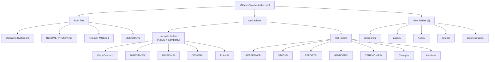

# Setup: Folder Structure

*The full folder tree of a single orchestrator. The root files, the work folders with their Active/Complete lifecycle, and the five infra folders, plus how to create it.*

← [00_SETUPS_INDEX](./00_SETUPS_INDEX.md) · [Orchestrator OS](../00_MOC.md)

---

## What you are setting up

Every orchestrator carries the **full structure** below. This is the floor, not "only when volume warrants." It has three parts: the **root files** (identity and boot), the **work folders** (where the domain's artifacts live, five of them with an `Active/` and `Complete/` lifecycle), and the **five infra folders** (commands, agents, hooks, setups, secrets-rotation). The Gatekeeper rejects any orchestrator missing a piece.

## The tree



The five lifecycle folders each contain an `Active/` and a `Complete/` subfolder. An item moves Active to Complete the moment it ships or closes; Complete is point-in-time history and is never edited retroactively. Wikilinks survive the move because Obsidian resolves by basename.

## The layout in text

```
<Name>/
  Operating System.md          # in-folder pointer to ceremony + contract + library
  RESUME_PROMPT.md             # boot + live state
  <Name> MOC.md                # the hub
  MEMORY.md                    # the orchestrator's own role memory
  REFERENCE/                   # durable methods + standards it owns          (flat)
  MISSIONS/      Active/ Complete/    # large multi-phase initiatives
  PLANS/         Active/ Complete/    # strategy / roadmaps
  DESIGNS/       Active/ Complete/    # single-issue design decisions
  DIRECTIVES/    Active/ Complete/    # dispatchable work orders
  Daily Contract/ Active/ Complete/   # the day's operating terms
  STATUS/                      # live trackers + run logs                     (flat)
  REPORTS/                     # ledgers / gap maps / test maps               (flat)
  HANDOFFS/                    # session-to-session briefs                    (flat)
  CEREMONIES/                  # in-folder pointers to its ceremony + contract (flat)
  Changes/                     # its change ledger, or a pointer to central   (flat)
  Archives/                    # superseded docs, date-prefixed               (flat)
  commands/                    # its command / prompt library
  agents/                      # its agent roster
  hooks/                       # its hooks
  setups/                      # its stack setup / onboarding docs
  secrets-rotation/            # secret inventory + rotation schedule, NEVER values
```

## Prerequisites

- A chosen `<Name>` for the orchestrator that follows [naming-conventions](../rules/naming-conventions.md) (Title-Case domain folders, lowercase infra and role/data subfolders, `00_<NAME>_INDEX.md` for in-folder indexes).
- The mold in hand: [orchestrator-standard](../the-standard/orchestrator-standard.md) sections 3, 3a, and 3.6 are the authority for this tree.

## Setup steps

1. **Pick the path.** Either copy [example-orchestrator](../orchestrators/example-orchestrator.md) wholesale and rename, or build the tree from scratch with the script below. Copying is faster and starts you compliant.
2. **Create the root and root files.** Make `<Name>/` and add the four root files: `Operating System.md`, `RESUME_PROMPT.md`, `<Name> MOC.md`, `MEMORY.md`.
3. **Create the work folders.** Add `REFERENCE/`, `STATUS/`, `REPORTS/`, `HANDOFFS/`, `CEREMONIES/`, `Changes/`, `Archives/` as flat folders.
4. **Add the lifecycle subfolders.** For each of `Daily Contract/`, `DIRECTIVES/`, `MISSIONS/`, `DESIGNS/`, `PLANS/`, create an `Active/` and a `Complete/` subfolder inside it.
5. **Create the five infra folders.** Add `commands/`, `agents/`, `hooks/`, `setups/`, `secrets-rotation/`. Each holds the orchestrator's own slice plus a pointer to the canonical central source, no content duplication.
6. **Drop in the in-folder indexes.** Each infra folder gets a `00_<NAME>_INDEX.md`. Link the agents library path-explicit (`[[Agents/00_AGENTS_INDEX|Agents]]`) so a bare link does not mis-resolve.
7. **Confirm the secrets rule.** `secrets-rotation/` holds the inventory and the rotation cadence only. Never a secret value in the knowledge base.
8. **Register and cross-link.** Fill every index per the birth checklist and add two-way links so the new folder is not a graph orphan.

### Create it from a shell (POSIX / Git Bash)

```bash
NAME="<Name>"
cd "<path-to-your-vault>"
mkdir -p "$NAME"/{REFERENCE,STATUS,REPORTS,HANDOFFS,CEREMONIES,Changes,Archives}
for f in "Daily Contract" DIRECTIVES MISSIONS DESIGNS PLANS; do
  mkdir -p "$NAME/$f/Active" "$NAME/$f/Complete"
done
mkdir -p "$NAME"/{commands,agents,hooks,setups,secrets-rotation}
touch "$NAME/Operating System.md" "$NAME/RESUME_PROMPT.md" "$NAME/$NAME MOC.md" "$NAME/MEMORY.md"
```

## You are done when

- All four root files exist.
- The five lifecycle folders each have both `Active/` and `Complete/`; the flat folders have neither.
- All five infra folders exist, each with a `00_<NAME>_INDEX.md` and a pointer to the canonical central source.
- `secrets-rotation/` contains inventory and cadence only, with zero secret values.
- The new folder is reachable from its MOC with two-way links and no orphans, so it passes the Gatekeeper's layout and cross-link checks.

## Related

- [orchestrator-standard](../the-standard/orchestrator-standard.md) - sections 3, 3a, 3.6 define this tree.
- [naming-conventions](../rules/naming-conventions.md) - casing, indexes, and path-explicit links.
- [example-orchestrator](../orchestrators/example-orchestrator.md) - a worked tree you can copy.

*Created by Alex Villarroel · part of Orchestrator OS.*
