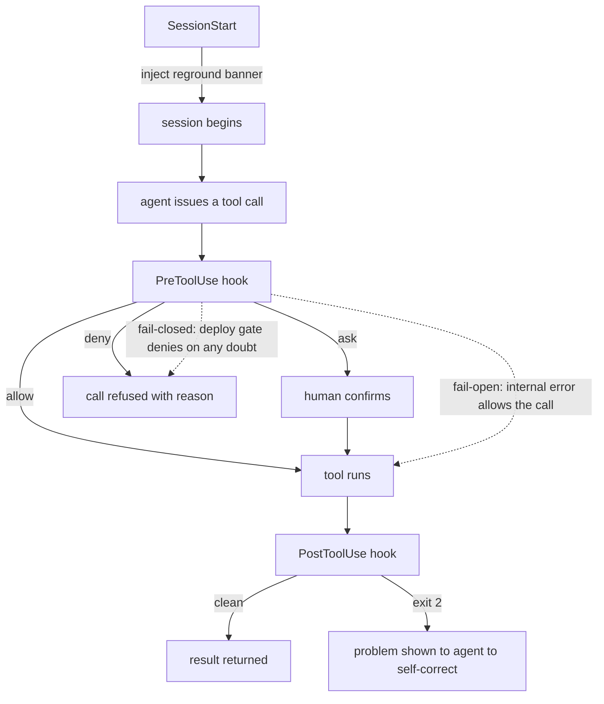

# Setup: The Enforcement Hooks

*Wire the enforcement hooks into a real setup: copy the scripts, register them in settings.json, keep the kill switch handy, test each decision from the shell, then soak warn-first before you flip anything to block.*

← [00_SETUPS_INDEX](./00_SETUPS_INDEX.md) · [Orchestrator OS](../00_MOC.md)

---

## What you are setting up

A hook is a command the agent harness runs automatically on a lifecycle event: before or after a tool call, at session start. It reads the event as JSON on stdin and can allow, ask, deny, or inject context. Rules written in a prompt are remembered, not enforced; an agent drops a fraction of its instructions on any given turn. A hook is the opposite: a script the harness runs on every matching tool call, in every session, with no chance to forget. Anything deterministic and high-stakes belongs in a hook.

This guide wires the example scripts (EOL guard, frozen zone, dangerous transform, deploy gate, session start) into a `.claude/settings.json` so they actually fire.

## Where hooks fire



PreToolUse fires before the tool and is the only place to block or ask. PostToolUse fires after and reports problems for the agent to self-correct. SessionStart fires once and injects context. The dotted arrows are the two postures: a fail-open hook allows the call on any internal error so a buggy guard never bricks legitimate work, while the fail-closed deploy gate denies on any doubt because a deploy is irreversible. Pick the posture by blast radius: reversible plus uncertainty equals allow, irreversible plus uncertainty equals deny.

## Setup steps

1. **Copy the scripts into the config.** Place the hook scripts in your `.claude/hooks/` folder (or a path the harness can resolve). They are plain Node scripts that read stdin and write stdout, so Node is the only prerequisite.

2. **Decide the scope.** User scope (`~/.claude/settings.json`) applies to every session on the machine, good for broad safety nets like the dangerous-transform guard. Repo scope (`.claude/settings.json` in the project) applies only inside that repo, good for repo-specific rules like the frozen zone and the deploy gate. Keep the scope as narrow as the rule.

3. **Register the hooks block in settings.json.** Hooks live under a `hooks` key, grouped by event. Each entry has a `matcher` (a regex over the tool name) and a list of commands. Use absolute paths or a `$VAR` the harness resolves; the `<hooks-dir>` below stands in for your install root (for example `~/.claude/hooks` for a user-scope install, or `.claude/hooks` for a repo-scope install):

   ```json
   {
     "hooks": {
       "PreToolUse": [
         {
           "matcher": "Edit|Write",
           "hooks": [
             { "type": "command", "command": "node <hooks-dir>/eol-guard.js snapshot" },
             { "type": "command", "command": "node <hooks-dir>/frozen-zone.js" }
           ]
         },
         {
           "matcher": "Bash|Shell|PowerShell",
           "hooks": [
             { "type": "command", "command": "node <hooks-dir>/dangerous-transform.js" },
             { "type": "command", "command": "node <hooks-dir>/deploy-gate.js" }
           ]
         }
       ],
       "PostToolUse": [
         {
           "matcher": "Edit|Write",
           "hooks": [
             { "type": "command", "command": "node <hooks-dir>/eol-guard.js verify" }
           ]
         }
       ],
       "SessionStart": [
         {
           "matcher": "startup|resume|compact",
           "hooks": [
             { "type": "command", "command": "node <hooks-dir>/session-start.js" }
           ]
         }
       ]
     }
   }
   ```

   The EOL guard is wired twice on purpose: a `snapshot` pass on PreToolUse and a `verify` pass on PostToolUse.

4. **Know the kill switch.** Every script checks `HOOKS_OFF=1` first and exits immediately when set. It is the escape hatch for the rare case where a hook is in the way and you accept the risk. Note that it also lifts the fail-closed deploy gate, so use it consciously:

   ```bash
   HOOKS_OFF=1 <deploy-command>
   ```

5. **Test each decision from the shell.** Hooks read stdin and write stdout, so they test without the harness. Pipe a sample event and inspect the exit code and output. Confirm all four decisions plus the kill switch:

   ```bash
   # frozen-zone should ASK on a frozen file
   echo '{"tool_name":"Edit","tool_input":{"file_path":"src/<frozen-module>"}}' \
     | node frozen-zone.js

   # dangerous-transform should DENY a blind in-place transform
   echo '{"tool_name":"Bash","tool_input":{"command":"sed -i s/a/b/ f.js"}}' \
     | node dangerous-transform.js

   # deploy-gate should DENY with no fresh green proof present
   echo '{"tool_name":"Bash","tool_input":{"command":"<deploy-command>"},"cwd":"."}' \
     | node deploy-gate.js

   # kill switch should let everything through (no output, exit 0)
   echo '{"tool_name":"Bash","tool_input":{"command":"sed -i s/a/b/ f.js"}}' \
     | HOOKS_OFF=1 node dangerous-transform.js
   ```

6. **Soak warn-first, then flip to block.** Do not wire everything to `deny` on day one. Block only the clear-cut cases first (the confirmed EOL flip, the blind in-place transform). Run the rest as `ask` for a few sessions to tune the matchers against real traffic, then tighten to `deny` once the patterns are clean. The deploy gate is the exception: it is fail-closed from the start because a bad deploy is irreversible. Before you enable the deploy gate, set `DEPLOY_COMMAND_PATTERN` to your real deploy command (for example `npm run deploy` or your release script). The shipped default also matches a bare `deploy` verb, which is deliberately broad and will catch unrelated commands that contain the word; pin it to the actual command so the gate fires on the real deploy and nothing else.

## You are done when

- The hooks block is in the correctly scoped `settings.json` and the harness loads it without error.
- Each hook returns its intended decision from the shell test: allow, ask, deny, and injected context, plus the kill switch passing everything through.
- A deliberately bad action is stopped by a hook, not by a human noticing (a frozen-file edit asks, a blind in-place transform is denied, a deploy with no fresh green proof is refused).
- The fail-open hooks allow the call on an internal error, and the fail-closed deploy gate denies on any doubt.
- The clear-cut cases block while the rest soak as `ask` before you tighten them.

## Related

- [README](../hooks/README.md): the full enforcement layer, the control contract, the decision schema, and every script.
- [00_HOOKS_INDEX](../hooks/00_HOOKS_INDEX.md): the index of the individual hook scripts.
- [setup-agents](./setup-agents.md) and [setup-commands](./setup-commands.md): the building blocks the hooks protect.

*Created by Alex Villarroel · part of Orchestrator OS.*
