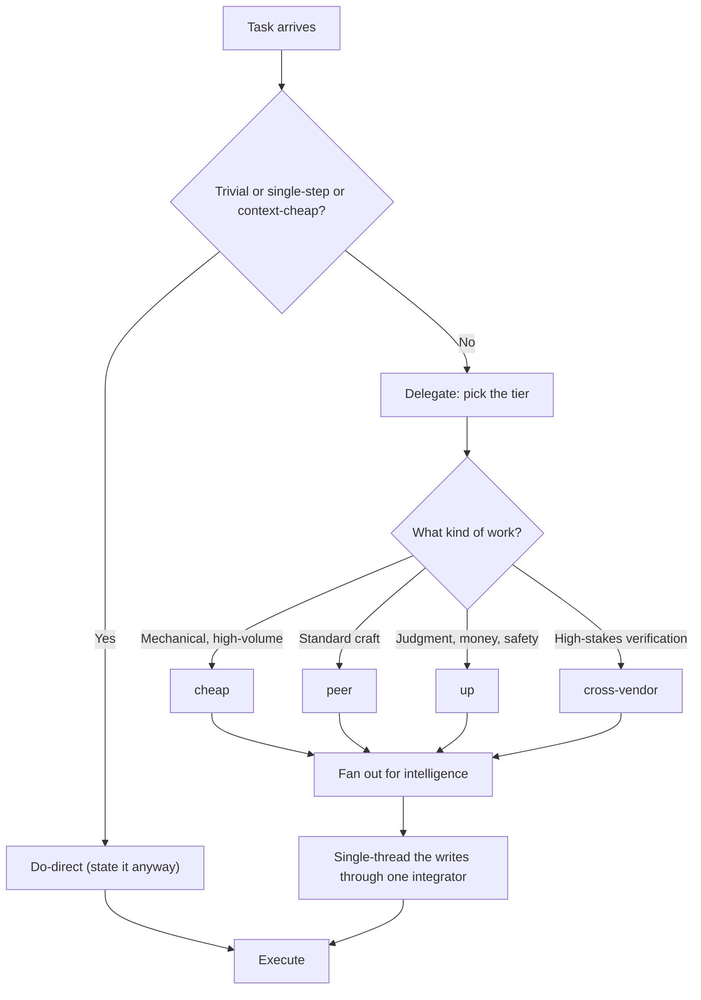

# Setup: Adopt the Orchestration-First Intake Habit

*How to make the direct-versus-delegate call out loud on every non-trivial task, route it to the right tier, and keep writes single-threaded, until it is muscle memory.*

← [00_SETUPS_INDEX](./00_SETUPS_INDEX.md) · [Orchestrator OS](../00_MOC.md)

Related: [orchestration-first](../rules/orchestration-first.md) · [the-orchestrator-pattern](../orchestrators/the-orchestrator-pattern.md)

---

## What you are setting up

A posture, not a reflex to delegate everything. Before acting on any non-trivial task you state one intake line, decide direct-versus-delegate against a fast gate, pick a tier, fan out for intelligence, and keep the writes single-threaded through one integrator. The gate cuts both ways: trivial work stays direct.

## The decision



---

## Setup steps

### 1. Learn the one-line intake notation

On any non-trivial task, before executing, state exactly one line:

```
intake: do-direct | delegate -> <cheap|peer|up|cross-vendor> · why
```

This single line is the whole habit made visible. It generalizes what the build ceremonies and triage roles already do, to every session, in one place. Say it before you act, not after.

### 2. Apply the do-direct gate

Do-direct when delegating would cost more than the work itself: trivial, single-step, or context-cheap tasks where the brief plus spawn latency plus a lossy summary back would exceed the task. Reads, lookups, a one-line edit, a status check, a relay, or a synthesis and decision only you hold.

Delegate when the task is craft (authored quality), breadth (parallelizable recon or research), specialized judgment, or work that would bloat your context. Do not delegate the trivial just to look orchestration-first.

### 3. Pick the tier in the same breath

The tier field is mandatory on every delegate decision. Route it, do not remember it case by case:

| Tier | Use for |
|---|---|
| cheap | mechanical, high-volume, low-judgment work |
| peer | standard craft at the same tier |
| up | deep judgment, money, safety, multi-step reasoning |
| cross-vendor | high-stakes verification where a different model's failure-mode diversity catches errors a same-model reviewer shares |

### 4. Fan out for intelligence, single-thread the writes

Reads, analysis, lenses, recon, and drafts-for-review fan out freely across as many disposable workers as the work needs. The actual writes, commits, and deploys stay single-threaded through one integrator. Parallel writers turn into a game of telephone and leave conflicting copies in the base. One mind owns the merge.

### 5. Stay honest about cost

Orchestration is justified by decision quality, sustained context across a long session, and parallel wall-clock time. It is not justified by cost-parity: a frontier orchestrator plus subagents is usually more tokens, not fewer. Measure, do not assume the cost evens out, and never delegate trivial work on the false premise that it is cheaper.

### 6. Make it a habit

- Put the paste-ready rule at the top of your session context or system prompt so it is the first thing every session reads.
- Require the intake line as the first output on any non-trivial task. No line, no action.
- Optionally enforce it with a hook that flags a non-trivial task with no intake line (see the hooks layer in [Orchestrator OS](../00_MOC.md)).
- Review your own transcripts: count tasks where you skipped the line, or delegated something trivial. Both are misses.

Paste-ready rule:

```
ORCHESTRATION-FIRST (every session). On any non-trivial task, before acting, state one line:
  intake: do-direct | delegate -> <cheap|peer|up|cross-vendor> · why
Do-direct only when delegating would cost more than the work (trivial / single-step / a
synthesis only you hold). Otherwise delegate craft, breadth, specialized judgment, or
context-bloating work, at the right model tier. Fan out for INTELLIGENCE; keep WRITES
single-threaded (one integrator). Orchestration buys quality + sustained context +
parallelism, not cheaper tokens. Measure, do not assume.
```

---

## You are done when

- [ ] You state the intake line before acting on every non-trivial task, without being prompted.
- [ ] Trivial and single-step work is done direct, not delegated for show.
- [ ] Every delegate decision names a tier (cheap, peer, up, or cross-vendor) and a reason.
- [ ] High-stakes verification routes cross-vendor for failure-mode diversity.
- [ ] Intelligence work fans out, and writes go through exactly one integrator.
- [ ] You justify orchestration on quality and parallelism, not on cost, and you measure rather than assume.

The habit is installed when the intake line is automatic and the gate stops you from delegating the trivial as readily as it pushes you to delegate the heavy.

---

*Setup guide for the intake discipline. See [orchestration-first](../rules/orchestration-first.md) for the rule in full and [the-orchestrator-pattern](../orchestrators/the-orchestrator-pattern.md) for what an orchestrator is and when to spawn versus embody.*

← [00_SETUPS_INDEX](./00_SETUPS_INDEX.md) · [Orchestrator OS](../00_MOC.md)

*Created by Alex Villarroel · part of Orchestrator OS.*
