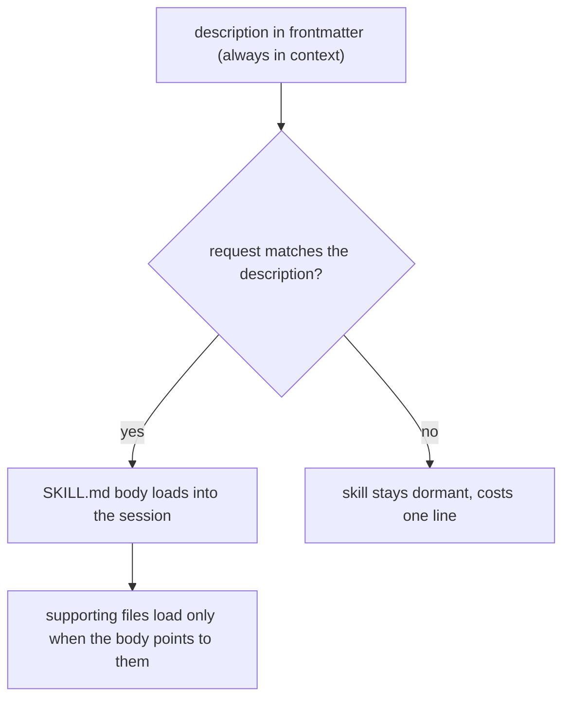

# Setup: Skills

*Stand up a model-invoked skill: a `SKILL.md` folder whose description Claude matches on its own to pull a procedure into context, loaded progressively so the always-on cost is a single line. Use it for the conventions and procedures you keep re-explaining.*

← [00_SETUPS_INDEX](./00_SETUPS_INDEX.md) · [Orchestrator OS](../00_MOC.md)

---

## What you are setting up

A skill is a folder with a `SKILL.md` at its root that you drop into `.claude/skills/`. The frontmatter `description` tells Claude when the skill applies; the body tells Claude what to do once it does. From then on Claude reaches for the skill on its own whenever your request matches the description, with no slash command typed. It is the home for a procedure or convention you want applied without having to ask for it every time.

A skill is the model-invoked building block. A [command](./setup-commands.md) is what a human types and times. An [agent](./setup-agents.md) is a worker an orchestrator spawns. A [hook](./setup-hooks.md) is a script that enforces a rule with no judgment. A skill is the one Claude pulls in by itself when the work fits.

## How a skill loads (progressive disclosure)



Only the one-line description sits in context full time. The body loads on the turn the skill fires, and any reference files load only when the body sends Claude to them. That is what keeps a skill cheap: a dormant skill costs a single line, not its whole procedure.

## Setup steps

1. **Create the skill folder.** Make `.claude/skills/<skill-name>/` in your project (or `~/.claude/skills/<skill-name>/` for a personal skill available across all projects). The folder name becomes the `/command` name, so name it for the action: `changelog-entry`, `commit-message`, `api-conventions`.

2. **Write `SKILL.md` with frontmatter.** Open the file with YAML frontmatter. Every field is optional; only `description` is recommended, because that is the text Claude matches against.

   ```markdown
   ---
   name: changelog-entry
   description: Write a changelog entry for a change in Keep a Changelog format. Use when the user asks to add a changelog entry, update the changelog, or record what changed.
   allowed-tools: Read, Edit
   ---

   # Changelog Entry

   Add an entry to CHANGELOG.md describing a change.

   ## Steps
   1. ...
   ```

   Keep the folder name and the frontmatter `name` in sync. Do not invent frontmatter fields: the supported set includes `name`, `description`, `when_to_use`, `allowed-tools`, `disallowed-tools`, `disable-model-invocation`, `user-invocable`, `argument-hint`, `arguments`, `model`, `effort`, `context`, `agent`, `hooks`, `paths`, and `shell`. Check the Claude Code skills docs before reaching for one you have not used.

3. **Write the description for matching.** This is the load-bearing field. Put the key use case first and name the phrases a user would actually say ("add a changelog entry", "update the changelog"). Claude fires the skill on this text, and the listing truncates long descriptions, so lead with the trigger.

4. **Keep the body short, push detail to supporting files.** Put the trigger and the everyday instructions in `SKILL.md`, under roughly 500 lines. If the skill needs a long format spec or sample outputs, drop them in the same folder as `reference.md` or `examples/` and point at them from the body with a one-line note on what each contains. They load only when Claude opens them.

   ```text
   changelog-entry/
     SKILL.md        # required: the trigger and the core instructions
     reference.md    # optional: the full format spec, loaded only when needed
   ```

5. **Decide who invokes it.** By default both you and Claude can invoke a skill. For anything with a side effect you want to time yourself, a deploy, a send, add `disable-model-invocation: true` so it is manual-only with `/name`. For background knowledge that is not a meaningful command, add `user-invocable: false` so only Claude pulls it in.

6. **Skill or hook?** If the rule must never be skipped, it is a [hook](../hooks/00_HOOKS_INDEX.md), not a skill. A skill carries model judgment and can be skipped if the model decides it does not apply. Enforce the un-skippable with a script; let skills carry the procedures that need the model to read context and adapt.

7. **Test that it triggers.** Open Claude Code in a project, make the skill available, and ask something that matches the description ("add a changelog entry for this fix"). Confirm Claude pulls the skill in on its own. Also invoke it directly with `/<skill-name>` to confirm the body runs. If it does not trigger, the description is missing the keywords a user would say; tighten it.

8. **Reconcile the index.** Add the skill's row to [00_SKILLS_INDEX](../skills/00_SKILLS_INDEX.md) in the same change that adds the folder, link it path-explicitly, and confirm the `SKILL.md` footer links back up. No orphans.

## You are done when

- The skill lives at `.claude/skills/<skill-name>/SKILL.md` with valid frontmatter and a folder name that matches its `name`.
- The `description` leads with the use case and names the phrases that should trigger it, and Claude pulls the skill in on its own when you ask in those words.
- The body is short, with any long reference material pushed to supporting files in the same folder and referenced from `SKILL.md`.
- Anything with a side effect is `disable-model-invocation: true`, and any un-skippable rule lives in a hook instead.
- The skill's row is in [00_SKILLS_INDEX](../skills/00_SKILLS_INDEX.md), path-explicit, with the footer linking back, zero orphans.

## Related

- [the-skill-pattern](../skills/the-skill-pattern.md): the full pattern, the commands-vs-skills-vs-agents split, the frontmatter, and how skills fit the orchestration system.
- [changelog-entry](../skills/changelog-entry/SKILL.md): a generic worked skill built to this guide.
- [setup-commands](./setup-commands.md) and [setup-agents](./setup-agents.md): the user-typed and spawned-subagent building blocks next to this one.

*Created by Alex Villarroel · part of Orchestrator OS.*
