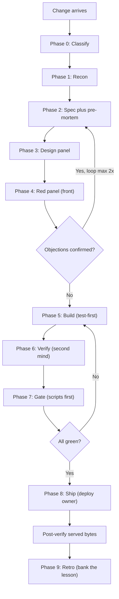

# Setup: Run a Change Through the Build Ceremony

*How to take one change from idea to verified, shipped artifact by running each phase of the build ceremony with subagents, every time.*

← [00_SETUPS_INDEX](./00_SETUPS_INDEX.md) · [Orchestrator OS](../00_MOC.md)

Related: [build-ceremony](../ceremonies/build-ceremony.md) · [multi-agent-contract](../ceremonies/multi-agent-contract.md) · [00_AGENTS_INDEX](../agents/00_AGENTS_INDEX.md)

---

## What you are setting up

A repeatable per-change spine you, as the orchestrator, run on the main thread while dispatching disposable subagents for the leaf work. You frame, dispatch, verify, and integrate. You never do the leaf work yourself, and you never ship red.

## The flow



---

## Setup steps

### 1. Classify, and write the one line before you act

Before touching anything, state the classifier line so any session can read your intent and the owner can override it:

```
operation=<FIX|FEATURE|CHANGE|REFACTOR|INCIDENT> · size=<trivial|small|standard|large> · lane=<D|F|S|C> (touches: <fact>) · phases=<mask> · skipped=<named>
```

Set the lane from what the change actually touches, never from how the request was phrased. Anything touching a safety-critical key (money, auth, merge or shared state, public surface, schema, single-writer resource) or any migration or deletion is at least Standard, Critical by floor. Doubt goes to the higher lane, recorded with the fact that locked it.

The lane decides how much of the back half bites:

| Lane | Qualifies | Rigor |
|---|---|---|
| D: Docs/Drafts | no app code | inline author plus one judge |
| F: Fast | one module, no risk flag, small diff | inline recon, test-first, back panel only |
| S: Standard | multi-module or new entity or shared state | recon lenses plus front and back panels |
| C: Critical | any of money, auth, merge, public, schema, single-writer; or migration or deletion | full ceremony, both panels, two security lenses |

### 2. Recon: map the real bytes with a read-only subagent

Dispatch a recon subagent (see [00_AGENTS_INDEX](../agents/00_AGENTS_INDEX.md), recon-cartographer) with a read-only fence. Ask it to return: build-ready anchors, the data model, the exact frozen helpers, the call graph, the reference exemplar to mirror, the per-file line-ending convention, and the keys-touched manifest (every state or storage key and every endpoint the target reads or writes). Set the risk flags from what it finds, not from the request.

For FEATURE or large work, add a research-and-reuse check: look for a proven implementation or in-repo exemplar to adopt before writing net-new. Adopt over invent.

Gate: every touched stored or merge key has its merge branch identified or is flagged missing. Anchors are real. Unconverged after two passes means stop and ask.

### 3. Spec plus pre-mortem: freeze the contract, then break it on paper

On the main thread, write the testable contract: acceptance criteria as observable assertions, invariants, out-of-scope, definition-of-done, rollback, observability. Keep discovered facts (read from code) separate from business constraints (only the owner supplies these, never inferred from code).

On any safety-critical flag, fill the worksheet before any design exists: the dedupe or identity key, the empty-input fallback, the id-generation source (never max id plus one), the status lifecycle, the fail-mode table (a fail-open to fail-closed flip is a blocker), and which single engine owns the value.

Then dispatch the pre-mortem subagent: tell it the change shipped and broke, and have it write the most likely post-incident report. Turn each hazard it names into an invariant or a test before any code exists.

### 4. Design panel: imitate by default, contest only when open

If the recon exemplar dictates the shape, clone it and label only the deltas. Contest the design only when two or more plausible architectures have different blast radius: dispatch two or three biased designer subagents, anonymize their proposals A/B/C, and have a judge subagent pick a winner plus grafts. Do not run a contest on a question recon could have answered.

Gate: the design covers 100 percent of the spec criteria; rollback and observability are non-empty.

### 5. Red panel (front): refute the plan before it is built

Dispatch the red lenses for this change's risk class as fresh-context subagents, told to refute, not review, and fed the spec and design only, never the implementer's reasoning. Pick the lens by what the change touches:

| Risk in the change | Lens | What it attacks |
|---|---|---|
| money, billing, totals | red-money | double-count, recompute, reconciliation divergence |
| auth, endpoint, role, secret | red-auth | boundary holes, privilege escalation, secret source to sink leak |
| migration, importer, new state key | red-migration | stored-shape change, missing merge branch, orphaned keys |
| merge, shared state, multi-writer | red-concurrency | lost update, delete-resurrection, empty-wipe, tombstone gaps |
| mixed-version deploy | red-version | old-client and new-server window |
| portal, export, customer-facing, public | red-surface | data leakage, injection, PII in output |
| empty, first-run, missing-data | red-edge | empty-state, no-feedback, first-run breakage |
| any change | red-correctness | spec-vs-impl gaps, null and boundary, error paths |

Evidence rule: a finding ships only with an exact anchor plus a concrete counterexample plus why current guards miss it. A clean lens is a valid result. A finding is confirmed when half the skeptics independently raise the same violated invariant with an anchor, or one irrefutable counterexample exists. Loop back to design at most twice, then stop. Lane F skips this front panel because there the plan is the diff, so the panel runs at the back.

### 6. Build: test-first, single-writer, in-lane only

Dispatch one builder subagent (leaf work is always a spawn, never an embody). Brief it to write the behavioral assertions from the spec first, watch them go red for the right reason, then green, building only in the in-lane files. It reuses existing save and compute functions, authors no new safety-critical math (that flows through the frozen engine), escapes every free-text interpolation, and makes backup-first, count-asserted edits. On any failure it restores, re-recons, and re-authors. It never patches the patch, and it stops at staged plus reported.

Gate: the suite is green for the right reasons; any change to shared state or a handler has at least one assertion exercising the integrated wiring.

### 7. Verify: a second mind, in parallel

A different mind than the builder re-runs the load-bearing checks. Dispatch the verify checks in parallel in one batch at stage-complete, since they share no dependency:

- Frozen-proof: the untouchable cores are byte-identical to the prior shipped artifact.
- Drift-check: only the intended files differ and exactly the intended new keys appeared; the diff matches the design.
- Behavioral verify: for any UI or public-surface change, drive the served artifact and confirm the visible outcome happens, console clean.
- Byte-exactness: the line-ending convention of each touched file is preserved (verify it yourself; builders mis-report this) and a syntax check passes on each edited file.

Re-run each risk-class red lens against the staged diff in the same batch so a concurrently-dispatched lens runs truly blind. Gate: all independent checks green. Any miss means re-brief with the specific fix; do not ship.

### 8. Gate: scripts before verdicts

Run the deterministic gate on the staged artifact. No panel verdict counts toward shipping until every scripted line is green: artifact asserts (file whitelist, entry-count baseline, this change's content markers, every standing assert), the cache-bust matrix, the tripwire runner (every active tripwire row green), and a secret, PII, and leak scan. A single critical-category failure blocks at 100 percent. Any red line means no ship.

### 9. Ship: the deploy owner, in the foreground

Exactly one role ships, never a builder. Package by iterating the prior artifact's entry list and copying each file from disk (append any new file first), then deploy in the foreground. Post-verify served bytes: hit the live surface, confirm health, confirm the change's marker is present in the served bytes, run the public-surface tripwire rows plus a PII scan against the live surface. Optionally soak with a timed re-check loop. "Shipped" means served-bytes verified, full stop. Then update the trackers.

### 10. Retro: bank the lesson

After any Critical ship, any incident, or on cadence: dispatch a retrospective subagent to turn misses into lessons, lessons into rules, rules into ceremony changes. Every fixed defect adds a tripwire row (an exact assert that fires if the bug returns) and, where the bug is not greppable, a behavioral regression test written failing the moment it is found. On a cadence, run a whole-app deep audit that sees accumulated state, not just the diff.

---

## You are done when

- [ ] The classifier line was stated before any work, locked to a fact, with skipped phases named.
- [ ] Recon returned real anchors, per-file line-endings, and a keys-touched manifest with merge branches identified.
- [ ] The spec has at least one executable criterion per non-trivial behavior, plus rollback, plus the worksheet if any safety-critical flag fired.
- [ ] The red lenses for this risk class ran fed spec and design only, and every confirmed objection was resolved.
- [ ] The build was test-first and in-lane, with wiring assertions on any shared-state change.
- [ ] A second mind verified frozen-proof, drift, behavioral, and byte-exactness, in parallel.
- [ ] Every scripted gate line is green and no leak strings remain.
- [ ] Served bytes show the change, health is green, and the trackers are updated.
- [ ] A tripwire row (and any needed regression test) was banked for every fix.

If any box is unchecked, the change is not shipped. It is staged at best.

---

*Setup guide for the per-change spine. See [build-ceremony](../ceremonies/build-ceremony.md) for the full ceremony, [multi-agent-contract](../ceremonies/multi-agent-contract.md) for the roster and dispatch rules, and [00_AGENTS_INDEX](../agents/00_AGENTS_INDEX.md) for the subagent briefs.*

← [00_SETUPS_INDEX](./00_SETUPS_INDEX.md) · [Orchestrator OS](../00_MOC.md)

*Created by Alex Villarroel · part of Orchestrator OS.*
