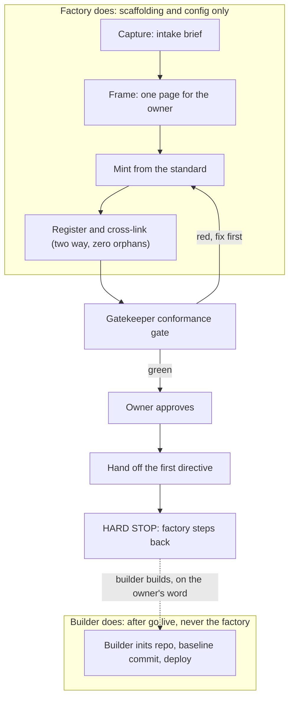

*Use the factory to mint NEW orchestrators from one shared standard, so you do not hand build each one: capture the idea, frame it, mint the scaffolding from the mold, register and cross-link, pass the gatekeeper gate, get the owner's go, then hand off. The factory mints scaffolding and then STOPS before the build.*

← [00_SETUPS_INDEX](./00_SETUPS_INDEX.md) · [Orchestrator OS](../00_MOC.md)

---

## What the factory is for

Building one orchestrator by hand teaches you the shape (see [setup-an-orchestrator](./setup-an-orchestrator.md)). The factory makes that repeatable: it frames a raw idea and mints a tailor made orchestration system for it (a folder, a tailored ceremony and contract, a prompt pack, a boot handoff, and a builder), using [orchestrator-standard](../the-standard/orchestrator-standard.md) as the mold. Every orchestrator comes out shaped the same way, so any session is legible and nothing drifts.

> factory mints, gatekeeper gates, owner approves, the new orchestrator lives

## Prerequisites

- You have read [factory-ceremony](../ceremonies/factory-ceremony.md) (the mint flow) and [gatekeeper-ceremony](../ceremonies/gatekeeper-ceremony.md) (the gate and the flywheel).
- You have read [orchestrator-standard](../the-standard/orchestrator-standard.md) so you know every birth component the mint must produce.
- You have, or can shape with the owner, a real idea: its domain, the irreversible action that will need a gate, the frozen or forbidden zone, and the builder it will need.
- You have a gatekeeper role available to run the conformance gate, and an owner who approves go live.

## The mint flow (and where it stops)

The dotted line is the hard line. The factory mints the orchestration scaffolding and config, then stops at the gate. It never initializes version control, commits product source, sets a remote, pushes, deploys, or edits feature code. Those are the minted orchestrator's or its builder's first acts, after go live, on the owner's word.

## Setup steps

### 1. Capture

Write the intake brief. What the idea **is**, its domain, the **safety critical action** that will need a gate, the **frozen or forbidden zone**, and the **builder(s)** it will need (code? a repo? which agents?). Separate the owner's product intent from inferred detail; never invent a constraint the owner has to set. First check the lane: a genuinely new domain mints; an idea that belongs to an existing orchestrator routes there (do not mint a duplicate); a vague spark gets shaped with the owner first, not minted on a fog.

### 2. Frame the orchestrator

One page, shown to the owner before you mint: its domain, its lanes and profiles, its roles, its model routing, and its safety gate. Frame before you mint so the owner can correct the shape cheaply.

### 3. Mint from the standard (tailored, never copied)

Generate every birth component the standard names, tailored to the real idea, to the FULL structure:

- **Root files:** the operating system pointer, a resume prompt, a map of content index, and a memory file.
- **Work folders:** reference, missions, plans, designs, directives, a daily contract, status, reports, handoffs, ceremonies, archives, with `Active/` and `Complete/` on the lifecycle folders.
- **Infra folders:** `commands/` (the full prompt pack, not a thin stub), `agents/` (point at the shared agent library path explicit, and separately at any external reference library), `hooks/`, `setups/`, and a secrets-rotation inventory and schedule (NEVER values).
- **A tailored ceremony and contract** for the new orchestrator's domain ([build-ceremony](../ceremonies/build-ceremony.md) and [multi-agent-contract](../ceremonies/multi-agent-contract.md) are the patterns).
- **A boot handoff** and **the builder** (for code: a repo brief plus the repo's agent config, a project instructions file, and a proposed ignore file; for non code: the sub-agent roster).

Name the frozen and forbidden zones at birth, before the builder writes a line. Every folder gets a README or index.

### 4. Register and cross-link (two way, zero graph orphans)

Fill every index in the RIGHT section (start here, home, table of contents, the atlas with a row and a count and a passing drift check, the directory) AND make each new folder's index wikilink list its members so every new file has an inbound link. Use path explicit links `[[Folder/Name|Name]]` for shared basenames. A query generated list makes no graph edge, so it does not satisfy this. Verify zero orphans before the gate. Do not edit the gatekeeper owned standard; PROPOSE its roster row and let the gatekeeper fold it at the gate.

### 5. Gatekeeper gate

Hand to the gatekeeper for the conformance gate: the standard's checklist plus the builder spec plus the ceremony pattern, on BOTH the vault and the repo side. The gatekeeper runs its self checks (drift auditor: every cited file and link resolves; completeness critic: every index reconciled, nothing stale, not over built). A missing box means not born. Fix any red and re gate.

### 6. Owner approves

A new orchestrator is a standing addition to the system; it goes live only on the owner's word. Nothing goes live un gated and un approved.

### 7. Hand off, then the factory stops

The new orchestrator takes its first directive from the owner; the factory steps back and logs the mint. This is the hard stop: the factory has minted scaffolding and config only. The builder's first act, on the owner's word, may be "initialize version control and baseline commit the repo," but that is the builder building, not the factory. Initializing version control and committing the product IS building, so it stays on the gated builder's side.

## You are done when

- Every birth component the standard names exists, tailored not copied, on both the vault and the repo side.
- Every index is reconciled in the right section and a backlink check shows zero graph orphans.
- The gatekeeper conformance gate is 100 percent green and the owner has approved go live.
- The frozen and forbidden zones were named at birth.
- The mint is logged (revert ready), the new orchestrator has taken its first directive, and the factory has stepped back having committed NO product source and deployed nothing.

## Related

- [factory-ceremony](../ceremonies/factory-ceremony.md): the full mint flow and the hard line this guide operationalizes.
- [gatekeeper-ceremony](../ceremonies/gatekeeper-ceremony.md): the conformance gate and the retro flywheel that evolves the mold.
- [orchestrator-standard](../the-standard/orchestrator-standard.md): the mold the factory mints from and the gatekeeper enforces.
- [setup-an-orchestrator](./setup-an-orchestrator.md): build one by hand first, then mint the rest with the factory.

---
*Setup the factory: Orchestrator OS. Adapted from ECC orch-pipeline and the Anthropic Claude Code subagent and project config model.*

← [00_SETUPS_INDEX](./00_SETUPS_INDEX.md) · [Orchestrator OS](../00_MOC.md)

*Created by Alex Villarroel · part of Orchestrator OS.*
