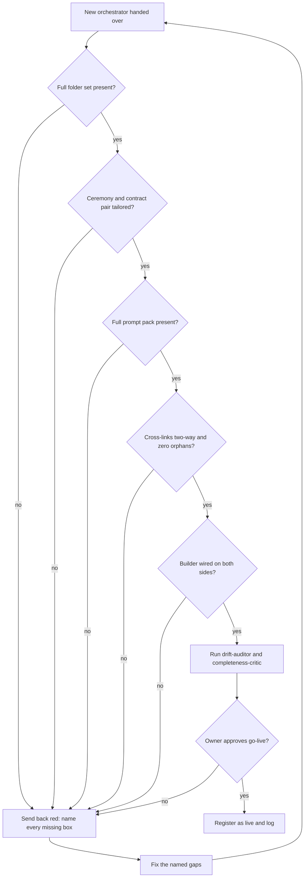

# Setup: The Gatekeeper

*Run the conformance gate on a freshly minted orchestrator so a missing birth component is caught before anything goes live, not after.*

← [00_SETUPS_INDEX](./00_SETUPS_INDEX.md) · [Orchestrator OS](../00_MOC.md)

Related: [gatekeeper-ceremony](../ceremonies/gatekeeper-ceremony.md) · [orchestrator-standard](../the-standard/orchestrator-standard.md)

---

## What this sets up

The gatekeeper is the gate every new orchestrator passes before it is registered as live. The factory hands over a newly minted orchestrator and its builder; the gatekeeper walks a fixed checklist over both the knowledge base and the outside code repo. Every box must be green. A single red box means not born yet: send it back, fix, re-run.

This guide is the operator runbook for that gate. It does not change the law. Changes to the standard route through the flywheel in [gatekeeper-ceremony](../ceremonies/gatekeeper-ceremony.md).

---

## The gate as a flow

---

## Prerequisites

- The orchestrator standard is the source of truth for what "complete" means. Read [orchestrator-standard](../the-standard/orchestrator-standard.md) section 2 (the birth checklist) and section 3 (the folder layout) before you start.
- You have read access to both sides: the knowledge base folder and the outside code repo (its source plus its agent and hooks config).
- The reviewer agents are available to spawn by type: drift-auditor and completeness-critic.
- You are the gatekeeper for this run, not the author of the orchestrator being gated. The author cannot pass their own gate.

---

## Setup steps

### 1. Check the folder set

Confirm the new orchestrator carries the full standard structure, not a thin subset.

- Root files present: the operating system pointer, the resume, the map, the role memory.
- Every work folder present, with the in-flight and complete lifecycle subfolders on the five lifecycle folders.
- All five infra folders present (commands, agents, hooks, setups, secrets rotation), each with its own slice plus a pointer to the canonical central source.
- Confirm no secret value lives anywhere in the knowledge base; the secrets folder holds inventory and a rotation schedule only.

A missing folder or a folder without its required subfolders is a red box.

### 2. Check the ceremony and contract pair

Confirm a tailored master ceremony and a tailored multi-agent contract exist, and that both match the invariant skeleton.

- The ceremony states a classifier before acting, sets lanes by rigor, has a per-task spine, and names the gate before the irreversible action.
- The contract names the roles, the dispatch standard, the decision protocol, and the never-do guardrails.
- Tailored, not copied: the frozen and forbidden zones, the model map, and the specific irreversible action the gate protects are filled for this domain, not left as template text.

### 3. Check the prompt pack

Confirm a full prompt pack exists in the orchestrator's commands folder, not a single starter prompt.

- It carries the boot prompt plus the role's complete situational set.
- It was generated through the sandbox and re-run to validate that the prompts keep each sub-role in lane. See [setup-the-sandbox](./setup-the-sandbox.md) for that loop.

### 4. Check cross-links and zero orphans

This is the box that gets skipped most, so check it by hand.

- Every index reconciled in the right section: the start-here entry, the home hub, the table of contents, the atlas with both its row and its count, and the directory.
- Two-way links: the new orchestrator links to its roster siblings and the roster links back; provenance links to the factory that minted it and to the standard it was built to.
- Resolve backlinks on every new doc. Every new file must have at least one inbound wikilink. A file that is degree zero in the graph is a red box.
- Use path-explicit links for any shared basename. A query-driven table aggregates but makes no graph edge, so it does not satisfy this check on its own.

### 5. Check the builder

Confirm at least one builder is wired to the orchestrator and is complete on both sides.

- Knowledge side: the builder brief, resume, and spec docs the builder reads.
- Outside side, for a code or artifact builder: the code repo with its source and its agent and hooks config where the builder works, stages, and is verified.
- A non-code orchestrator's builder tier is its sub-agent roster, knowledge side only.

A code builder with only one side present is a red box.

### 6. Run the self-check before any irreversible fold

Spawn the two reviewers in parallel:

- drift-auditor: confirm every cited file and link resolves and the handover matches what was proposed, with no scope drift.
- completeness-critic: confirm every index is reconciled, nothing the change touched is left stale, and the orchestrator is not over-built.

A red from either reviewer means do not register; fix first.

### 7. Route to owner approval or send back red

- If every box is green and both reviewers pass, present to the owner. A new orchestrator goes live only on the owner's explicit word.
- On approval: register the orchestrator as live and write a revert-ready changelog entry recording the creation and the commit.
- If any box is red: do not register. Return the named gaps to the author, let them fix, and re-run the gate from step 1.

---

## You are done when

- Every box in steps 1 through 5 is green on both the knowledge base and the outside repo.
- drift-auditor and completeness-critic both pass.
- The owner has approved go-live in writing.
- The orchestrator is registered in every index with clean backlinks and zero graph orphans.
- A revert-ready changelog entry records the go-live and its commit.

If any one of these is missing, the orchestrator is not born yet.

---
*Setup guide for the conformance gate. The runbook form of [gatekeeper-ceremony](../ceremonies/gatekeeper-ceremony.md), enforcing [orchestrator-standard](../the-standard/orchestrator-standard.md). Adapted from established orchestration practice and generalized for any domain.*

*Created by Alex Villarroel · part of Orchestrator OS.*
