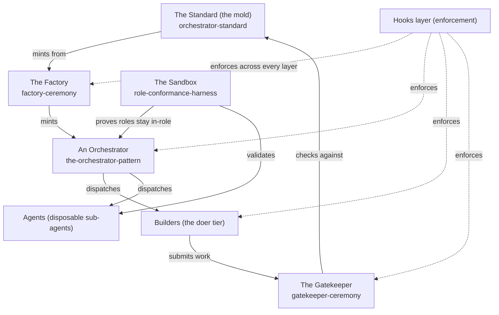

# Setup: The Whole System

*The architecture overview. How the layers of Orchestrator OS fit together, and the order to set them up in.*

← [00_SETUPS_INDEX](./00_SETUPS_INDEX.md) · [Orchestrator OS](../00_MOC.md)

---

## What you are setting up

Orchestrator OS is the layer ABOVE the agents. Its components are a **Standard** (the mold), the **Orchestrators** (persistent points-man for a domain, carrying the orchestrator pattern and the workflow pattern), the **Ceremonies** plus the **multi-agent contract** (the operating spines, including the factory that mints and the gatekeeper that enforces the standard), a **Sandbox** that proves roles stay in-role, and the building blocks the orchestrators draw on: **Agents**, **Commands**, **Skills**, **Hooks**, **Rules**, and **Setups**. The **Builders** are the doer tier each orchestrator dispatches.

You do not "install" this like an app. You read it in order, then stand up the pieces in dependency order: the mold first, then the factory that uses the mold, then your first orchestrator, then the doers, with the gate and the hooks wrapping everything.

## How it fits together

The solid arrows are the flow of work. The dotted arrows are the Hooks layer, which is not a stage but a cross-cutting enforcement net: it runs the rules as scripts at every layer so they cannot be skipped.

## Prerequisites

- A Markdown knowledge base you can navigate by wikilink (Obsidian, or just GitHub rendering both Markdown and Mermaid).
- A coding-agent CLI that reads a `.claude/` config (agents, hooks, settings) if you intend to stand up a code orchestrator and its builder.
- Git, for the outside code repo a code builder works in.
- Node, only if you want the example hook scripts in [README](../hooks/README.md) to actually run.

## Setup steps

1. **Read the repo in order.** Start at [the map](../00_MOC.md), then read [orchestrator-standard](../the-standard/orchestrator-standard.md) end to end. This is the contract everything else conforms to. Do not skip it because it "looks like docs" - the section numbers (the birth checklist, the folder standard, the gate) are referenced everywhere.
2. **Understand the orchestrator shape.** Read [the-orchestrator-pattern](../orchestrators/the-orchestrator-pattern.md). The shape is constant; only the domain changes. A persistent point-man fans out for intelligence and keeps writes single-threaded.
3. **Stand up the Factory.** Read [factory-ceremony](../ceremonies/factory-ceremony.md). The factory is the ceremony that mints a new orchestrator from the mold. You set it up once; it produces every orchestrator after.
4. **Mint your first orchestrator.** Run the factory ceremony against one real domain. The fastest path is to copy [example-orchestrator](../orchestrators/example-orchestrator.md) and rename, then fill the birth checklist from the standard. See [setup-folder-structure](./setup-folder-structure.md) for the exact tree you must end up with.
5. **Wire at least one Builder.** Every orchestrator needs a doer tier. For a code orchestrator this is a real builder spanning a knowledge brief PLUS an outside code repo with its own `.claude/` config. Set up one immediately; add more as the domain grows.
6. **Point the orchestrator at the Agents library.** Link your own categorized library path-explicit (`[[Agents/00_AGENTS_INDEX|Agents]]`); everyone spawns from it by type. A bare link mis-resolves to a different library.
7. **Turn on the Gatekeeper.** Read [gatekeeper-ceremony](../ceremonies/gatekeeper-ceremony.md). Nothing is "live" until it passes the gate: the birth checklist is 100 percent green, both builder locations exist, the cross-links are two-way with no orphans, and the folder layout matches the standard.
8. **Install the Hooks layer.** Read [README](../hooks/README.md). Copy the relevant hooks into your `.claude/` so the rules (`eol-guard`, `frozen-zone`, `dangerous-transform`, `deploy-gate`, `session-start`) run as code at every layer instead of relying on memory.
9. **Prove roles with the Sandbox.** Read [role-conformance-harness](../sandbox/role-conformance-harness.md). Run each new orchestrator and agent through the harness to confirm it classifies, dispatches, verifies, and stays in-role before you trust it on real work.

## You are done when

- You can trace one request from intake, through the orchestrator's classify-dispatch-verify loop, through a builder, through the gate, to a closed result.
- A brand-new orchestrator you minted passes the Gatekeeper with every birth-checklist box green and zero graph orphans.
- The hooks actually fire (a deliberately bad commit is blocked by a hook, not by a human noticing).
- Each role passes the role-conformance harness.

## Related

- [orchestrator-standard](../the-standard/orchestrator-standard.md) - the mold every layer conforms to.
- [factory-ceremony](../ceremonies/factory-ceremony.md) - how a new orchestrator is minted.
- [gatekeeper-ceremony](../ceremonies/gatekeeper-ceremony.md) - the gate that makes a mint "live."
- [the-orchestrator-pattern](../orchestrators/the-orchestrator-pattern.md) - what an orchestrator is.
- [role-conformance-harness](../sandbox/role-conformance-harness.md) - proving roles stay in-role.
- [README](../hooks/README.md) - the enforcement layer.
- [setup-folder-structure](./setup-folder-structure.md) - the exact folder tree of an orchestrator.

*Created by Alex Villarroel · part of Orchestrator OS.*
