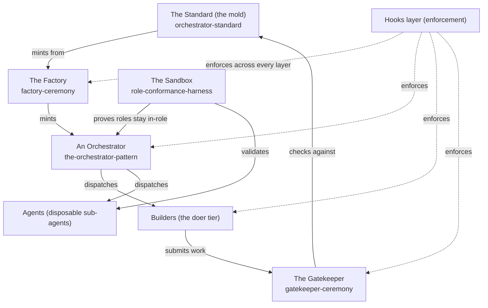

# Setup: The Whole System

*The architecture overview. How the layers of Orchestration OS fit together, and the order to set them up in.*

← [[setups/00_SETUPS_INDEX|00_SETUPS_INDEX]] · [[00_MOC|Orchestration OS]]

---

## What you are setting up

Orchestration OS is the layer ABOVE the agents: a **Standard** (the mold), a **Factory** that mints orchestrators from the mold, the **Orchestrators** themselves (persistent points-man for a domain), the **Builders + Agents** they dispatch, a **Gatekeeper** that enforces the standard, a **Sandbox** that proves roles stay in-role, and a **Hooks** layer that makes the rules un-forgettable by running them as code.

You do not "install" this like an app. You read it in order, then stand up the pieces in dependency order: the mold first, then the factory that uses the mold, then your first orchestrator, then the doers, with the gate and the hooks wrapping everything.

## How it fits together

The solid arrows are the flow of work. The dotted arrows are the Hooks layer, which is not a stage but a cross-cutting enforcement net: it runs the rules as scripts at every layer so they cannot be skipped.

## Prerequisites

- A Markdown knowledge base you can navigate by wikilink (Obsidian, or just GitHub rendering both Markdown and Mermaid).
- A coding-agent CLI that reads a `.claude/` config (agents, hooks, settings) if you intend to stand up a code orchestrator and its builder.
- Git, for the outside code repo a code builder works in.
- Node, only if you want the example hook scripts in [[hooks/README|README]] to actually run.

## Setup steps

1. **Read the repo in order.** Start at [[00_MOC|the map]], then read [[the-standard/orchestrator-standard|orchestrator-standard]] end to end. This is the contract everything else conforms to. Do not skip it because it "looks like docs" - the section numbers (the birth checklist, the folder standard, the gate) are referenced everywhere.
2. **Understand the orchestrator shape.** Read [[orchestrators/the-orchestrator-pattern|the-orchestrator-pattern]]. The shape is constant; only the domain changes. A persistent point-man fans out for intelligence and keeps writes single-threaded.
3. **Stand up the Factory.** Read [[ceremonies/factory-ceremony|factory-ceremony]]. The factory is the ceremony that mints a new orchestrator from the mold. You set it up once; it produces every orchestrator after.
4. **Mint your first orchestrator.** Run the factory ceremony against one real domain. The fastest path is to copy [[orchestrators/example-orchestrator|example-orchestrator]] and rename, then fill the birth checklist from the standard. See [[setups/setup-folder-structure|setup-folder-structure]] for the exact tree you must end up with.
5. **Wire at least one Builder.** Every orchestrator needs a doer tier. For a code orchestrator this is a real builder spanning a knowledge brief PLUS an outside code repo with its own `.claude/` config. Set up one immediately; add more as the domain grows.
6. **Point the orchestrator at the Agents library.** Link your own categorized library path-explicit (`[[Agents/00_AGENTS_INDEX|Agents]]`); everyone spawns from it by type. A bare link mis-resolves to a different library.
7. **Turn on the Gatekeeper.** Read [[ceremonies/gatekeeper-ceremony|gatekeeper-ceremony]]. Nothing is "live" until it passes the gate: the birth checklist is 100 percent green, both builder locations exist, the cross-links are two-way with no orphans, and the folder layout matches the standard.
8. **Install the Hooks layer.** Read [[hooks/README|README]]. Copy the relevant hooks into your `.claude/` so the rules (secret-scan, structure-lint, naming) run as code at every layer instead of relying on memory.
9. **Prove roles with the Sandbox.** Read [[sandbox/role-conformance-harness|role-conformance-harness]]. Run each new orchestrator and agent through the harness to confirm it classifies, dispatches, verifies, and stays in-role before you trust it on real work.

## You are done when

- You can trace one request from intake, through the orchestrator's classify-dispatch-verify loop, through a builder, through the gate, to a closed result.
- A brand-new orchestrator you minted passes the Gatekeeper with every birth-checklist box green and zero graph orphans.
- The hooks actually fire (a deliberately bad commit is blocked by a hook, not by a human noticing).
- Each role passes the role-conformance harness.

## Related

- [[the-standard/orchestrator-standard|orchestrator-standard]] - the mold every layer conforms to.
- [[ceremonies/factory-ceremony|factory-ceremony]] - how a new orchestrator is minted.
- [[ceremonies/gatekeeper-ceremony|gatekeeper-ceremony]] - the gate that makes a mint "live."
- [[orchestrators/the-orchestrator-pattern|the-orchestrator-pattern]] - what an orchestrator is.
- [[sandbox/role-conformance-harness|role-conformance-harness]] - proving roles stay in-role.
- [[hooks/README|README]] - the enforcement layer.
- [[setups/setup-folder-structure|setup-folder-structure]] - the exact folder tree of an orchestrator.

*Created by Alex Villarroel · part of Orchestration OS.*
