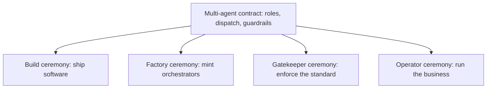
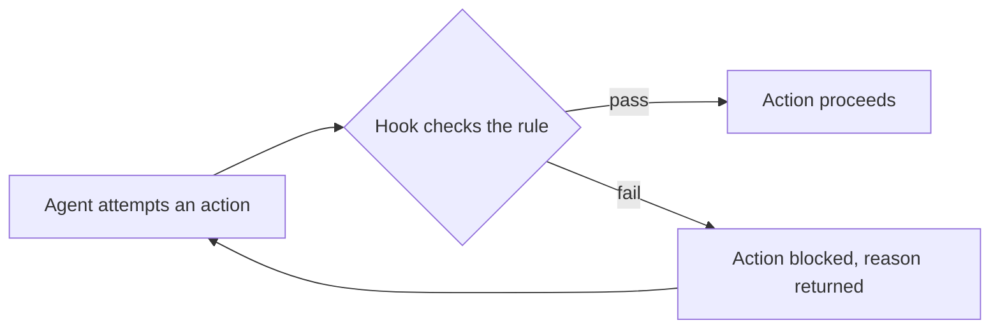
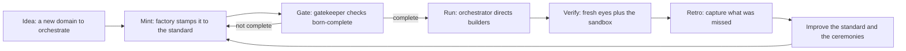
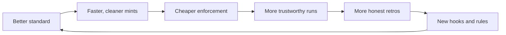

# The longform guide

*The deep dive. Every layer gets its own section, then we show how they lock together into a flywheel. ← [[00_MOC|Orchestration OS]] · [[README|README]].*

If [[the-shortform-guide|the-shortform-guide]] is the 30 minute introduction, this is the reference you come back to. It walks the whole system one layer at a time, in the order the layers depend on each other, then closes with the lifecycle that ties them together and the reason the whole thing gets stronger the more you use it.

Read the shortform first if you have not. Read [[the-philosophy|the-philosophy]] before either; everything here is a consequence of those six beliefs.

---

## 1. The orchestrator pattern

An orchestrator is a **persistent point-man for a domain that directs disposable sub-agents and never does the leaf work itself.** That sentence is the invariant. Only the domain changes.

What it actually does, every task:

1. **Classify** the request (what kind of task, how risky, do it directly or dispatch a specialist).
2. **Ground** itself in the real system, because the live source always beats any doc.
3. **Do or dispatch** with a tight brief that carries scope, fence, and acceptance criteria.
4. **Verify independently** with a fresh perspective that did not produce the work.
5. **Synthesize** for the human and record state.

The shape holds whether the domain is shipping software, running the business, or evolving the operating system itself. A build orchestrator, an operations orchestrator, and a meta orchestrator are the same pattern pointed at different work. Each one has at least one **builder**, its doer tier: the disposable sub-agents or real roles it dispatches to actually produce output. The orchestrator stays; the builders are spawned and thrown away.

The full definition lives in [[orchestrators/the-orchestrator-pattern|the-orchestrator-pattern]], and there is a complete worked instance in [[orchestrators/example-orchestrator|example-orchestrator]]. The reason an orchestrator can be this consistent is that it is minted from a single mold, which is the next section.

---

## 2. The standard, and why born-complete matters

The [[the-standard/orchestrator-standard|orchestrator-standard]] is the mold. It is the canonical definition of what an orchestrator IS and the exact checklist of what one needs to exist at all. The factory mints from it; the gatekeeper enforces it.

The core idea is **born complete, or not born** (principle 4 of [[the-philosophy|the-philosophy]]). A new orchestrator arrives with everything it needs or it does not arrive. There is no "we will add the prompts later" or "the links can come next week." Half-built things rot: they mislead the next reader, they hide gaps, and they quietly lower the bar for everything minted after them.

"Complete" is a concrete checklist, not a feeling. An orchestrator is not born until it has all of:

- a **folder** at the root with the full standard structure, including the lifecycle subfolders and the five infra folders (`commands/`, `agents/`, `hooks/`, `setups/`, `secrets-rotation/`),
- an **Operating System pointer** and a **RESUME prompt** (who it is, how it boots, its loop, its live state),
- its own **role memory** file,
- a tailored **Master Ceremony** and **Multi-Agent Contract**,
- a full **prompt pack**,
- a **boot handoff**,
- at least one **builder wired to it**,
- **registration in every index** and **two-way cross-links** so it is a real node in the graph, not an island,
- a **changelog entry** that is revert-ready.

Every box is mandatory. A missing box means "not born yet," not "born with a minor gap." That bright line is what keeps the system from accumulating debt: nothing enters in a state that would mislead.

See [[the-standard/orchestrator-standard|orchestrator-standard]] for the complete checklist and folder layout.

---

## 3. The ceremonies and the multi-agent contract

A **ceremony** is an operating spine: the repeatable sequence a role runs for a task, from intake to close. The system ships four, one per kind of work, plus the contract that governs how agents work together.

- **[[ceremonies/build-ceremony|build-ceremony]]** is the spine for shipping software: frame, recon, design, build single-threaded, verify with fresh eyes, gate before the irreversible deploy, close and retro.
- **[[ceremonies/factory-ceremony|factory-ceremony]]** is the spine for minting a new orchestrator from an idea, stamping it to the [[the-standard/orchestrator-standard|orchestrator-standard]] so it is born complete.
- **[[ceremonies/gatekeeper-ceremony|gatekeeper-ceremony]]** is the spine for enforcement: it runs the standard's checklist against a candidate and refuses to register anything that is not 100 percent green.
- **[[ceremonies/operator-ceremony|operator-ceremony]]** is the spine for running the business or the org, the non-code domain.

Every ceremony shares the same skeleton: a classifier stated before acting, lanes that set the rigor (cheap and reversible versus high-stakes and irreversible), a per-task spine, grounding discipline, a safety gate before the irreversible action, continuity (nothing half-done at a stop), and a flywheel that improves the ceremony itself.

The **[[ceremonies/multi-agent-contract|multi-agent-contract]]** is the structure underneath all of them: who the roles are, the bridge model (the orchestrator directs disposable sub-agents and never solo-commits the irreversible), the dispatch standard and return schema, the decision protocol, the model routing, and the guardrails. This is where the one rule lives in contract form: **fan out for intelligence, keep writes single-threaded.** Browse them all from [[ceremonies/00_CEREMONIES_INDEX|the ceremonies index]].

---

## 4. The agent library and the two-library rule

Ceremonies dispatch agents, and agents come from a library. Orchestration OS keeps a **categorized agent library**: red-team lenses, reviewers, security auditors, recon and design roles, retrospective analysts, plus growing domain categories. Every orchestrator points at it and anyone can spawn from it by type. The pattern is described in [[agents/the-agent-library-pattern|the-agent-library-pattern]] and the roster lives in [[agents/00_AGENTS_INDEX|the agents index]].

The hard-won rule here is the **two-library rule**, and it is not optional:

1. **Your own library** is the canonical, governed roster you build and run. It is the source of truth.
2. **An external reference library** is a third-party or upstream collection you **mine and adapt** for patterns, never blind-copy.

The two are not interchangeable. Borrowed patterns get an attribution line and are localized to your conventions before they enter your tree. And there is a sharp linking gotcha: **always link your own library path-explicit**, as `[[agents/00_AGENTS_INDEX|Agents]]`. A bare `[[Agents]]` mis-resolves to the external library's index whenever the two share a basename, which silently points your readers at the wrong tree. Path-explicit links for shared basenames are part of [[rules/naming-conventions|naming-conventions]].

---

## 5. The prompt-pack pattern

An orchestrator without prompts is a car without a key. The **prompt pack** is the role's complete, paste-ready set of operating prompts, and a full one is required for every orchestrator to be born complete.

A pack is not a thin starter. It carries the boot/resume prompt plus the role's full situational set. For a code orchestrator that means the everyday ones (fix-it, wave-run, stage-it, ship-it, incident, retro) plus builder-dispatch and builder-boot and any gate prompt. For a non-code orchestrator it means that role's full task set. Each pack lives in the orchestrator's own `commands/` folder and is indexed across orchestrators centrally.

The discipline that makes packs good: the role writes its own pack, tailored to itself, and you re-run it through the [[sandbox/role-conformance-harness|sandbox]] to validate that the prompts actually drive in-role behavior. The pattern is in [[commands/the-prompt-pack-pattern|the-prompt-pack-pattern]] with a worked example in [[commands/example-orchestrator-pack|example-orchestrator-pack]]; browse from [[commands/00_COMMANDS_INDEX|the commands index]].

---

## 6. The hooks enforcement layer

Here is where principle 2, **enforce, do not remember**, becomes code. A rule you only remember gets forgotten roughly a fifth of the time, and the one time it slips is the time it mattered. So anything a script can check becomes a script, not a note.

The **hooks** are small scripts that run automatically at defined points (before a tool runs, after a write, before a commit) and block the action when a rule is violated. They are what make the standard real rather than aspirational: a secret-scan hook refuses to let a secret value enter the knowledge base, a structure-lint hook refuses a folder that breaks the layout, and so on. The human cannot skip them because they are not asking the human.

This is the difference between a rule that lives in someone's memory and a rule that lives in the pipeline. The hooks follow Claude Code conventions and can be lifted into a real `.claude/` setup. See [[hooks/00_HOOKS_INDEX|the hooks layer]].

---

## 7. The sandbox and role conformance

Agents drift. A specialist asked only to analyze starts quietly editing; a director starts doing the leaf work itself. Drift defeats the whole point of the pattern, so the system tests for it the same way it tests software: independently, against a spec, by something that did not write the role.

The **sandbox** is the [[sandbox/role-conformance-harness|role-conformance-harness]]. It runs a role against scenarios and checks that the role behaves like its role: that the orchestrator dispatches instead of doing, that a read-only lens stays read-only, that a builder stays inside its fence. It is also where a role writes and validates its own prompt pack before that pack goes live (section 5). This is principle 6, "verify independently," applied to the roles themselves rather than to the code. See [[sandbox/00_SANDBOX_INDEX|the sandbox index]].

---

## 8. The knowledge-discipline rules

All of the above only works if the knowledge stays findable. Principle 5, **keep the knowledge a clean graph**, is enforced by a small set of rules:

- **[[rules/knowledge-discipline|knowledge-discipline]]** - every document has a home, a map that reaches it, and links both ways. One canonical version of each thing, never a pile of copies. Stale work moves to an archive; it is not deleted (which loses history) and not left in place (which misleads). No orphans: every doc has at least one inbound link.
- **[[rules/naming-conventions|naming-conventions]]** - consistent casing, `00_*_INDEX.md` for in-folder indexes, and path-explicit links for shared basenames (the same gotcha that bites the agent library in section 4).
- **[[rules/orchestration-first|orchestration-first]]** - the one rule as a standing rule: fan out for intelligence, write single-threaded, direct rather than do.

When you add or move a doc, you reconcile every index in the same change (the area index and [[00_MOC|the map]] together). A graph that drifts out of sync is a graph nobody trusts, and knowledge nobody can find does not exist. Browse from [[rules/00_RULES_INDEX|the rules index]].

---

## 9. The full lifecycle

Put the layers in motion and you get a single loop that runs from a raw idea to a system that is a little better than it was before. Each arrow is owned by a ceremony or a rule from the sections above.

- **Idea to mint** is the [[ceremonies/factory-ceremony|factory-ceremony]].
- **Mint to gate** is the [[ceremonies/gatekeeper-ceremony|gatekeeper-ceremony]] checking against the [[the-standard/orchestrator-standard|orchestrator-standard]]; a failed gate routes straight back to minting, never forward.
- **Gate to run** is the orchestrator working its domain via its [[ceremonies/build-ceremony|build-ceremony]] or [[ceremonies/operator-ceremony|operator-ceremony]], fanning out and writing single-threaded under the [[ceremonies/multi-agent-contract|multi-agent-contract]].
- **Run to verify** is independent verification plus the [[sandbox/role-conformance-harness|sandbox]].
- **Verify to retro to improve** is the retrospective loop folding lessons back into the standard and ceremonies, governed by [[rules/knowledge-discipline|knowledge-discipline]].

---

## 10. How it all reinforces itself: the flywheel

The reason this is an operating system and not just a folder of good ideas is that every part feeds the next, and the loop closes.

- A clean **standard** lets the **factory** mint fast and identical.
- Identical mints let the **gatekeeper** enforce a single bright line cheaply.
- A reliable gate lets **orchestrators** trust what they dispatch to.
- Independent **verification** and the **sandbox** catch the misses that any single mind would rationalize away.
- The **retro** turns each miss into a rule, and a rule a machine can check becomes a **hook**, so the same miss cannot happen twice.
- A better hook and a better standard make the next **mint** better still.

Each turn of the wheel raises the floor. Misses become rules, rules become hooks, hooks make the next build start from a higher baseline than the last. That is the flywheel: the system that builds things also rebuilds itself, and it gets harder to do the wrong thing every time around.

---

## Where to go next

- New here? Start with [[the-shortform-guide|the-shortform-guide]] and [[the-philosophy|the-philosophy]].
- Ready to build? [[setups/00_SETUPS_INDEX|The setups]] take you from download to running, with a diagram per piece, and [[setups/setup-the-whole-system|setup-the-whole-system]] wires it end to end.
- Want a finished example to copy? [[orchestrators/example-orchestrator|example-orchestrator]] and [[commands/example-orchestrator-pack|example-orchestrator-pack]].
- The map of everything: [[00_MOC|Orchestration OS]].

---

*The test of understanding: you can trace any single rule back to the belief in [[the-philosophy|the-philosophy]] that put it there, and forward to the hook that enforces it. When you can do that in both directions, you have the whole system.*

*Created by Alex Villarroel · part of Orchestration OS.*
