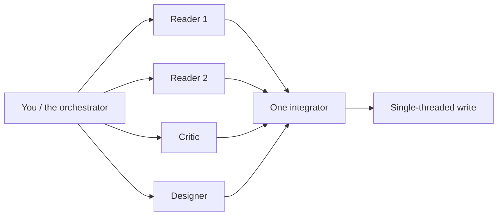
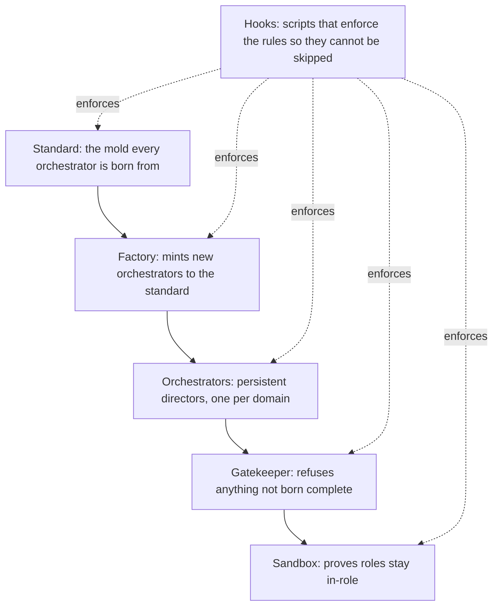

# The shortform guide

*The 30 minute introduction. If you read one thing before touching the system, read this. ← [[00_MOC|Orchestration OS]] · [[README|README]].*

You can learn the whole idea in half an hour. This guide gives you the core idea, the one rule that everything else hangs off, a five minute mental model of the layers, and a short "do this first" path that ends with you running a real change through the system. When you want depth, go to [[the-longform-guide|the-longform-guide]]. When you want hands-on setup with diagrams, go to [[setups/00_SETUPS_INDEX|the setups]].

---

## The core idea: be the director, not the doer

One person typing at one model hits a ceiling fast. You become the bottleneck: you read every file, you hold every detail, you write every line, and the quality of the result is capped by how much you can keep in your head at once.

Orchestration OS removes that ceiling by splitting the work into two kinds of worker:

- A **persistent orchestrator** that owns a domain. It does not do the leaf work. It frames the request, picks the right specialist, dispatches a tight brief, independently checks the result, and synthesizes for you. It remembers. It is the part that stays.
- **Disposable builders and specialists** that do the leaf work. Each is spawned for one job with a narrow brief, produces its output, and goes away. They are cheap, parallel, and forgettable. They are the part that is thrown away.

That is the shift in one line: **you stop being the doer and become the director of doers.** Your job is to frame, dispatch, verify, and decide. The orchestrator does that on your behalf for its domain, and you direct the orchestrator.

This is principle 3 of [[the-philosophy|the-philosophy]] ("orchestrate, do not solo") made operational. The full shape of the persistent role is in [[orchestrators/the-orchestrator-pattern|the-orchestrator-pattern]].

---

## The one rule: fan out for intelligence, write single-threaded

If you remember nothing else, remember this:

> **Fan out for intelligence. Keep writes single-threaded.**

Reading, analyzing, and proposing are safe to do in parallel and they get better the more parallel they are. Spawn five readers, five lenses, five critics at once. Each sees the problem fresh; together they see more than any one of them could. Parallel exploration is pure upside.

Writing is the opposite. The moment two workers both change the same thing, you get conflicts, lost edits, and a result assembled by telephone. So every change funnels through **one integrator**. Many minds propose; one hand writes. That keeps the work coherent no matter how wide you fanned out to understand it.

Fan out is wide and parallel. The write is a single line. This rule is why the result stays coherent even when a dozen agents touched the thinking. See [[rules/orchestration-first|orchestration-first]] for the rule in full and [[ceremonies/multi-agent-contract|multi-agent-contract]] for how the contract enforces it.

---

## The five minute mental model: the layers

The system is five layers stacked on top of each other. Each one constrains the one below it, and a thin layer of scripts (the hooks) makes the constraints impossible to forget.

Read it top to bottom:

1. **The standard** is the mold. It defines exactly what an orchestrator IS and what it needs to be "born complete": its folders, its operating spine, its prompts, its links, its builder. See [[the-standard/orchestrator-standard|orchestrator-standard]].
2. **The factory** mints new orchestrators from an idea, stamping each one to the standard so it arrives whole instead of half-built. See [[ceremonies/factory-ceremony|factory-ceremony]].
3. **The orchestrators** are the persistent directors, one per domain (shipping software, running the business, evolving the system itself). See [[orchestrators/the-orchestrator-pattern|the-orchestrator-pattern]] and the worked [[orchestrators/example-orchestrator|example-orchestrator]].
4. **The gatekeeper** holds the line: it refuses to register anything that is not 100 percent complete against the standard. Half-built things never go live. See [[ceremonies/gatekeeper-ceremony|gatekeeper-ceremony]].
5. **The sandbox** is the conformance harness. It tests that each role actually behaves like its role and does not drift into doing the leaf work itself. See [[sandbox/role-conformance-harness|role-conformance-harness]].

And underneath all of it, **the hooks**: small scripts that run the rules automatically so a tired human can never skip them. This is principle 2 of [[the-philosophy|the-philosophy]], "enforce, do not remember." A rule you only remember gets forgotten the one time it matters. See [[hooks/00_HOOKS_INDEX|the hooks layer]].

The payoff of the stack: every orchestrator is born the same shape, checked the same way, and kept honest the same way. You learn the pattern once and it holds everywhere.

---

## Do this first

Three steps, in order. They take you from reading to running a real change.

### 1. Read the philosophy

Open [[the-philosophy|the-philosophy]] and read all six principles. It is short on purpose. Everything else in the system is a consequence of those beliefs, so once they click the rest reads fast. Pay special attention to "orchestrate, do not solo" and "enforce, do not remember."

### 2. Copy the example orchestrator

Open [[orchestrators/example-orchestrator|example-orchestrator]] and read it as a finished, born-complete orchestrator. Notice that it arrives with everything: its folder layout, its operating spine, its prompt pack, its links both ways, and a builder wired to it. Then copy it as your starting point and rename it for your own domain. Do not start from a blank folder; start from a complete one and change the domain. The structure it follows is the [[the-standard/orchestrator-standard|orchestrator-standard]], and the way it gets minted cleanly is the [[ceremonies/factory-ceremony|factory-ceremony]].

### 3. Run one change through the build ceremony

Pick one small, real change and walk it through the [[ceremonies/build-ceremony|build-ceremony]] end to end:

- frame the request and classify it,
- fan out to understand the current state (read, recon, propose),
- dispatch a single builder to make the change single-threaded,
- verify with a fresh perspective that did not write the change (principle 6, "verify independently"),
- pass the [[ceremonies/gatekeeper-ceremony|gatekeeper]] before anything irreversible,
- close out and record what you learned.

Doing this once teaches you more than reading ten times. You will feel the difference between directing and doing, and you will see why the one rule exists.

---

## Where to go next

- Want the depth behind every layer? [[the-longform-guide|the-longform-guide]] gives each one its own section, plus the full lifecycle and the flywheel that makes the system improve itself.
- Want to set it up for real, with a diagram for every piece? [[setups/00_SETUPS_INDEX|The setups]] are the fastest path from download to running.
- Want the principles again, on their own? [[the-philosophy|the-philosophy]].
- Want the map of everything? [[00_MOC|Orchestration OS]].

---

*Thirty minutes in, you should be able to say what an orchestrator is, why writes are single-threaded, and what "born complete" means. If you can, you are ready for [[the-longform-guide|the-longform-guide]].*

*Created by Alex Villarroel · part of Orchestration OS.*
